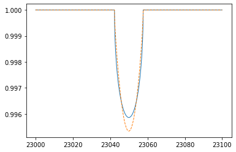

Rigid Stellar Rotation and Gaussian Convolution
===============================================

Here, we apply a rigid stellar rotation model to a mock spectrum.

.. code:: ipython3

    import numpy as np
    from exojax.spec.rtransfer import nugrid
    from exojax.spec import response

Setting a wavenumber grid as
    
.. code:: ipython3

    nus,wav,res=nugrid(23000,23100,2000,unit="AA")

and a mock spectrum, which exhibits a sharp dip in the center.
    
.. code:: ipython3

    #1 - delta function like
    F=np.ones_like(nus)
    F[1000]=0.0

Assuming Vsini=100km/s
    
.. code:: ipython3

    vsini=100.0 #km/s

`response.rigidrot <../exojax/exojax.spec.html#exojax.spec.response.rigidrot>`_ convolves a rigid (solid-body) rotation kernel to F. We can also take consideration `limb darkening <https://en.wikipedia.org/wiki/Limb_darkening>`_ with the coefficients (u1, u2).

.. code:: ipython3

    import matplotlib.pyplot as plt
    plt.plot(wav,response.rigidrot(nus,F,vsini,u1=0.0,u2=0.0),lw=1)
    plt.plot(wav,response.rigidrot(nus,F,vsini,u1=0.6,u2=0.4),lw=1,ls="dashed")
    plt.show()

Gaussian covolution and velocity shift can be involved using `response.ipgauss_sampling <../exojax/exojax.spec.html#exojax.spec.response.ipgauss_sampling>`_

.. code:: ipython3

    Frot=response.rigidrot(nus,F,vsini,u1=0.0,u2=0.0)
    Fx=response.ipgauss_sampling(nus,nus,Frot,20.0,0.0)
    Fxx=response.ipgauss_sampling(nus,nus,Frot,50.0,30.0)

.. code:: ipython3

    plt.plot(wav[::-1],Frot,lw=1,label="Vsini=100km/s")
    plt.plot(wav[::-1],Fx,lw=1,ls="dashed",label="Vsini=100km/s $\\ast \\beta$=20km/s")
    plt.plot(wav[::-1],Fxx,lw=1,ls="dotted",label="Vsini=100km/s $\\ast \\beta$=50km/s, RV=30km/s")
    plt.legend(loc="lower left")
    plt.ylim(0.993,1.0005)
    plt.show()

.. image:: rigid_rotation/output_8_0.png

The summation is conserved.

.. code:: ipython3

    print(np.sum(F))
    print(np.sum(response.rigidrot(nus,F,vsini,u1=0.6,u2=0.4)))
    print(np.sum(response.rigidrot(nus,F,vsini,u1=0.0,u2=0.0)))
    print(np.sum(Fx))

.. parsed-literal::

    1999.0
    1999.0
    1999.0
    1999.0

