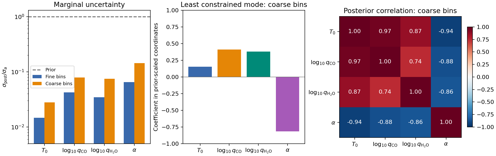

Spectral sensitivity, information, and degeneracy
=================================================

A spectrum containing CO and H2O responds to both molecular abundances,
temperature, and the temperature gradient. Those responses can resemble
one another, so a large derivative does not by itself guarantee a tight
abundance constraint. In particular, allowing the H2O abundance to vary
can broaden the CO uncertainty even when both molecules have visible
spectral features.
A Jacobian shows the individual responses; a covariance and its parameter
modes show which combinations are measured. This tutorial uses
ExoJAX automatic differentiation and ``linear_gaussian_diagnostics`` to
forecast local uncertainties and compare spectral binning, following the
information-based approach discussed by Batalha & Wogan (2026),
`Exoplanet Atmosphere Spectral Sensitivity Analysis with PICASO: Jacobians,
Linear-Gaussian Approximations, and Information Content
<https://arxiv.org/abs/2609.22634>`_.

The example uses small sets of real CO and H2O transitions, H2-H2
collision-induced absorption (CIA), and ``ArtEmisPure`` radiative transfer.
All data are bundled with the repository, so no downloads or retrieval run
are needed. The atmosphere and observational errors are illustrative; this
is not a forecast for a particular object or instrument.

Run the example
---------------

From a checkout with ExoJAX and Matplotlib installed:

.. code-block:: console

   JAX_PLATFORMS=cpu MPLBACKEND=Agg python examples/spectral_sensitivity.py

The script enables JAX 64-bit arithmetic and writes the two figures below
to ``documents/tutorials/spectral_sensitivity_files``. Use
``--output-dir /path/to/figures`` to choose another directory.
The :download:`complete example <../../examples/spectral_sensitivity.py>`
contains the imports, model setup, and plotting code.
Run it from the checkout so that the accompanying
``examples/spectral_sensitivity_data`` directory is available.
The :download:`CIA table <../../examples/spectral_sensitivity_data/H2-H2_2011_4320-4370.cia>`
is about 135 KiB.
On the CPU used for this example, data setup and diagnostics took about
11 seconds including the first JAX compilation, excluding imports and
plotting. The script prints this timing for your machine.

The molecular databases are the repository's 259-transition subset of
ExoMol Li2015 for :math:`{}^{12}\mathrm{C}{}^{16}\mathrm{O}` and
197-transition subset of
`POKAZATEL <https://www.exomol.com/data/molecules/H2O/1H2-16O/POKAZATEL/>`_
for :math:`{}^{1}\mathrm{H}_2{}^{16}\mathrm{O}`. Both include their
partition functions and H2 pressure-broadening data. The water subset was
selected with ``Sij0 > 1.0e-30`` at a reference temperature of 296 K;
it omits many transitions that matter at higher temperatures. These real
lines provide a compact example of joint abundance constraints, but the
selected water opacity is not a complete hot-atmosphere line list.
``OpaDirect`` evaluates both species' Voigt profiles directly.

The CIA file is a small spectral selection from HITRAN's
``H2-H2_2011.cia`` with unchanged coefficients: 4320--4370
:math:`\mathrm{cm^{-1}}`, with all 113 temperatures from 200 to 3000 K.
See the :download:`data provenance <../../examples/spectral_sensitivity_data/README.md>`
for its source and extraction details. This temperature coverage matters:
the full fiducial temperature profile lies inside the tabulated range, so
the CIA coefficients can respond to changes in temperature.

Define the observation and parameter coordinates
------------------------------------------------

We model a 24-layer atmosphere from :math:`10^{-4}` to 100 bar, using
``ArtEmisPure`` with four streams and

.. math::

   T(P)=T_0(P/1\,\mathrm{bar})^\alpha.

The fixed gravity is :math:`10^{4.4}\,\mathrm{cm\,s^{-2}}`, the mean
molecular weight is 2.33 atomic mass units, and the H2 volume mixing ratio
is 0.855. CO and H2O have constant mass mixing ratios :math:`q_{\rm CO}`
and :math:`q_{\rm H_2O}`. The example holds the background composition
fixed as these trace abundances vary. The two molecular line opacities
and H2-H2 CIA are added before solving the radiative transfer.

The parameters and independent Gaussian prior standard deviations are

.. math::

   \boldsymbol{\theta}=(T_0,\log_{10}q_{\rm CO},\log_{10}q_{\rm H_2O},\alpha),

.. math::

   \boldsymbol{\theta}_0=(1200\,\mathrm{K},-2.3,-2.3,0.1),\qquad
   \boldsymbol{\sigma}_a=(100\,\mathrm{K},0.5\,\mathrm{dex},0.5\,\mathrm{dex},0.03).

The Gaussian prior is defined in these coordinates; the two abundance
priors are therefore lognormal in linear mixing ratio. A uniform-prior
interval is not a Gaussian standard deviation.

The data and opacity calculators are initialized once, outside the
differentiated function. Temporary copies keep the database reader's caches
away from the installed molecular data:

.. literalinclude:: ../../examples/spectral_sensitivity.py
   :language: python
   :start-after: # BEGIN MODEL SETUP
   :end-before: # END MODEL SETUP
   :dedent: 4

The model first calculates emission at 4096 uniformly spaced cell midpoints
over 4330--4362 :math:`\mathrm{cm^{-1}}`, near the 2.3-micron CO band head.
It then averages groups of 16 cells into 256 nonoverlapping top-hat
observation bins. The output
is :math:`y_i=\langle F_{\tilde\nu}\rangle_i/F_*`, with the fixed scale
:math:`F_*=10^4\,\mathrm{erg\,s^{-1}\,cm^{-2}/(cm^{-1})}`. This is a
fixed unit conversion, not a fitted normalization. The figure displays bin
centers in wavelength, but the averages remain in wavenumber space.

Inside the forward model, both species' line strengths, Doppler widths,
pressure widths, CIA coefficients, and the thermal source function respond to
the temperature profile. The opacity matrices are recomputed for every
parameter vector, so their derivatives are included in the Jacobian.

.. literalinclude:: ../../examples/spectral_sensitivity.py
   :language: python
   :start-after: # BEGIN OBSERVED SPECTRUM
   :end-before: # END OBSERVED SPECTRUM
   :dedent: 4

The binning is inside ``observed_spectrum``, so ``jax.jacfwd`` differentiates
the complete observable. For your own model, include its convolution,
radial velocity, throughput, and sampling operations before taking the
Jacobian. In this example the only instrumental operation is the top-hat
average.

We assume independent, fixed Gaussian measurement errors
:math:`\sigma_{e,i}=0.03` on the scaled flux. This is an absolute error,
not a constant fractional error or a noise model differentiated with the
spectrum. No noisy realization is needed for this local forecast.

Compute the diagnostics
-----------------------

For the observation-space Jacobian
:math:`K_{ij}=\partial y_i/\partial\theta_j`, define diagonal error and
prior covariances :math:`S_e=\mathrm{diag}(\sigma_e^2)` and
:math:`S_a=\mathrm{diag}(\sigma_a^2)`. Linearizing the spectrum at
:math:`\boldsymbol{\theta}_0` gives

.. math::

   F=K^\mathsf{T}S_e^{-1}K,\qquad
   S_{\rm post}=(F+S_a^{-1})^{-1},\qquad
   A=S_{\rm post}F.

Here :math:`F` is the data Fisher matrix, :math:`S_{\rm post}` is the
local posterior covariance, and :math:`A` is the averaging kernel. The
diagonal of :math:`S_{\rm post}` gives the marginal variances after allowing
all four parameters to vary. The effective degrees of freedom and the
Gaussian entropy reduction in bits are

.. math::

   d=\mathrm{tr}(A),\qquad
   H=\frac{\ln\det S_a-\ln\det S_{\rm post}}{2\ln2}.

The factor :math:`\ln2` converts natural-log entropy to bits. This is a
covariance-based entropy reduction, not the realized posterior-to-prior
KL divergence, which also depends on the posterior mean displacement.

.. code-block:: python

   from exojax.utils.information import linear_gaussian_diagnostics

.. literalinclude:: ../../examples/spectral_sensitivity.py
   :language: python
   :start-after: # BEGIN DIAGNOSTICS
   :end-before: # END DIAGNOSTICS
   :dedent: 4

The function accepts a two-dimensional Jacobian, one noise standard
deviation per observation, and one prior standard deviation per parameter.
Both standard-deviation arrays must be finite and strictly positive.
It returns a dictionary containing ``fisher``, ``posterior_cov``,
``posterior_std``, ``averaging_kernel``, ``degrees_of_freedom``,
``information_bits``, ``singular_values``, and ``parameter_modes``.
Covariances and the averaging kernel use the original parameter coordinates.
Correlated errors or correlated priors are outside this function's scope.
The function can be JIT-compiled. Numerical input checks run on concrete
arrays; callers must ensure finite inputs and positive standard deviations
when supplying traced arrays. Differentiating the diagnostic function itself
has additional SVD restrictions, distinct from differentiating the forward
model to obtain its Jacobian.

Interpret sensitivities and weak modes
--------------------------------------

Temperature, log abundance, and the gradient exponent have different
scales. To compare modes we use the dimensionless Jacobian and parameter
perturbations

.. math::

   B_{ij}=\frac{K_{ij}\sigma_{a,j}}{\sigma_{e,i}},\qquad
   z_j=\frac{\theta_j-\theta_{0,j}}{\sigma_{a,j}},\qquad
   B=U\,\mathrm{diag}(s_k)V^\mathsf{T}.

Each row of ``parameter_modes`` is a row of :math:`V^\mathsf{T}`, ordered
by descending ``singular_values``. A mode coordinate is
:math:`a_k=\boldsymbol{v}_k^\mathsf{T}\boldsymbol{z}`. Its prior variance
is one and its posterior variance is :math:`1/(1+s_k^2)`. Thus
:math:`s_k\ll1` identifies a combination dominated by its prior, while
:math:`s_k\gg1` indicates substantial information from the observations.
Mode signs are arbitrary. In terms of these singular values,

.. math::

   d=\sum_k\frac{s_k^2}{1+s_k^2},\qquad
   H=\frac12\sum_k\log_2(1+s_k^2).

These expressions also remain well defined for a rank-deficient Jacobian
because the proper Gaussian prior supplies finite variance in its null
space. The implementation uses the scaled decomposition to avoid directly
inverting the Fisher matrix or forming determinants.

.. figure:: spectral_sensitivity_files/spectrum_and_jacobian.png
   :alt: CO and H2O emission spectrum with H2-H2 CIA and the scaled Jacobian with respect to temperature, both molecular abundances, and temperature gradient.

   The lower panel shows :math:`B`, the flux response to a one-prior-standard-
   deviation parameter change in units of the noise standard deviation.
   CO and H2O abundance changes have different spectral patterns, while
   temperature and its gradient affect both the line and continuum emission.
   The responses overlap without being identical, producing parameter
   correlations while retaining information on both species. Derivative
   curves describe local slopes, not finite excursions over the full prior.

Compare spectral binning with propagated noise
----------------------------------------------

The fine observation has 256 bins, each :math:`0.125\,\mathrm{cm^{-1}}`
wide. The coarse observation averages every eight adjacent fine bins,
giving 32 bins of width :math:`1\,\mathrm{cm^{-1}}`. Both cover the
same wavelength interval. The average is a fixed linear operator, so the
coarse Jacobian follows directly from the fine one:

.. math::

   \bar y_b=\frac18\sum_{i\in b}y_i,\qquad
   \bar K_{bj}=\frac18\sum_{i\in b}K_{ij},\qquad
   \bar\sigma_{e,b}=\frac{\sigma_e}{\sqrt8}.

The last relation propagates the independent equal errors of the fine bins.
It gives the coarse observation the gain in per-bin precision associated
with averaging the same measured data, with no additional exposure time.
This compares how much information is retained after binning under the
stated noise model; no instrument-specific photon-counting model is
assumed. The top-hat bins do not describe a specific spectrograph's
line-spread function.

The script gives the following rounded results:

.. list-table::
   :header-rows: 1

   * - Quantity
     - Fine bins
     - Coarse bins
   * - :math:`\sigma(T_0)` [K]
     - 1.470
     - 2.788
   * - :math:`\sigma(\log_{10}q_{\rm CO})` [dex]
     - 0.0212
     - 0.0392
   * - :math:`\sigma(\log_{10}q_{\rm H_2O})` [dex]
     - 0.0173
     - 0.0372
   * - :math:`\sigma(\alpha)`
     - 0.00195
     - 0.00432
   * - Information :math:`H` [bits]
     - 23.822
     - 20.717
   * - Effective degrees of freedom :math:`d`
     - 3.993
     - 3.967
   * - Smallest singular value
     - 12.08
     - 5.62

   Averaging spectral structure can weaken joint constraints even though
   each coarse bin has a smaller error. The weakest mode is expressed in
   prior-scaled parameter coordinates. Correlation entries are rounded to
   two decimals.

The coarse observation retains information on all four modes: even its
smallest singular value is greater than one. The weakest mode has
coefficients approximately :math:`(0.154,0.410,0.380,-0.815)` in the
prior-scaled coordinates: higher temperature and both abundances can
partially compensate for a shallower temperature gradient.
Its posterior CO and H2O abundances are positively correlated, with a
coefficient of about 0.74. Both abundances are anticorrelated with the
temperature gradient (about -0.88 for CO and -0.86 for H2O). The correlation matrix describes
the joint fit after allowing temperature and gradient to vary; it is not
simply a correlation between two derivative curves.

Binning increases the CO abundance uncertainty by a factor of about 1.9,
the H2O uncertainty by about 2.1, and the gradient uncertainty by about 2.2,
while losing approximately 3.1 bits of information. The degrees of freedom
remain close to four because all four modes remain data-informed.
This illustrates why mode strengths and marginal errors give useful detail
beyond a count of constrained parameters. Coarse binning loses the
within-bin differences between the parameter responses; those differences cannot be recovered
by increasing the precision of the bin average.

Compare joint and conditional abundance errors
-----------------------------------------------

To isolate the effect of uncertain H2O abundance on the CO measurement,
compare the four-parameter forecast with one that holds only the H2O
abundance exactly known. The fiducial spectrum still contains the same
water opacity, and the noise, temperature parameters, and CO prior are
unchanged. To calculate this conditional forecast, remove the H2O column
from the Jacobian and the
matching entry from the prior:

.. literalinclude:: ../../examples/spectral_sensitivity.py
   :language: python
   :start-after: # BEGIN FIXED WATER
   :end-before: # END FIXED WATER
   :dedent: 4

.. list-table:: Forecast CO uncertainty [dex]
   :header-rows: 1

   * - Treatment of H2O abundance
     - Fine bins
     - Coarse bins
   * - Fixed at its fiducial value
     - 0.0131
     - 0.0262
   * - Free, with the stated Gaussian prior
     - 0.0212
     - 0.0392
   * - Free / fixed uncertainty ratio
     - 1.62
     - 1.50

Allowing H2O to vary broadens the CO uncertainty by about 62% for the fine
bins and 50% for the coarse bins. This isolates the effect of one uncertain
abundance in the same spectrum. It does not compare the four-parameter
forecast with a spectrum from which water opacity has been removed.

For a Gaussian posterior, this is the usual distinction between marginal
and conditional covariance. If :math:`x=(T_0,\log_{10}q_{\rm CO},\alpha)`
and :math:`w=\log_{10}q_{\rm H_2O}`, partition the joint posterior covariance
into blocks. Holding :math:`w` fixed gives

.. math::

   S_{x\mid w}=S_{xx}-S_{xw}S_{ww}^{-1}S_{wx}.

The marginal covariance :math:`S_{xx}` includes the uncertainty propagated
from the water abundance. This explains why reporting a derivative or an
error computed with another absorber fixed can overstate the precision
available in a joint retrieval. In either case, the distinct molecular
response patterns help separate the abundances; neither calculation
assumes that the two spectra are identical.

Numerical checks
----------------

At the fiducial state, doubling the internal quadrature grid from 4096 to
8192 cells changes the binned flux by less than :math:`0.03\sigma_e` and
each Jacobian column by less than 0.1% of its maximum absolute amplitude.
The observation-space Jacobian also agrees with centered finite differences
to within :math:`3\times10^{-7}` on the same per-column scale, using steps
of :math:`10^{-3}` K for :math:`T_0`, :math:`10^{-5}` dex for each
log abundance, and :math:`10^{-6}` for :math:`\alpha`.
These checks concern the local numerical calculation; the finite line lists
and chosen atmospheric model still set the physical scope of the example.

Limits and applying this to a retrieval
---------------------------------------

Extend the CO/H2O model with your usual ExoJAX opacity sources and choose a
fiducial state and Gaussian prior in the exact coordinates passed to
``jax.jacfwd``. Include nuisance parameters such as
calibration or radius when they affect the intended observation; fixing
them can make a forecast too optimistic. If you change spectral binning,
propagate the measurement covariance with the same binning operator.
Averaging independent equal-error samples reduces their standard deviation
by the square root of the number averaged; overlapping kernels may produce
correlations that this diagonal-error interface cannot represent.

This is a local linear Gaussian forecast. Automatic differentiation computes
local derivatives accurately, but does not remove nonlinearity, multimodality,
physical boundaries, upper limits, or forward-model error. In particular,
parameter correlations need not remain linear over the full prior.
The selected molecular transitions, especially the strength-filtered water
subset, and H2-H2 CIA do not constitute a complete opacity model for an
observed atmosphere. Compare with posterior sampling
when those effects matter, and recompute at other plausible fiducial states
before drawing observing-strategy conclusions.
