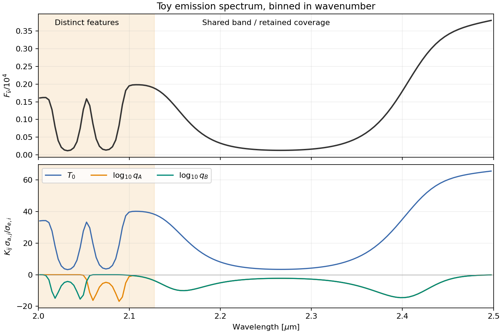
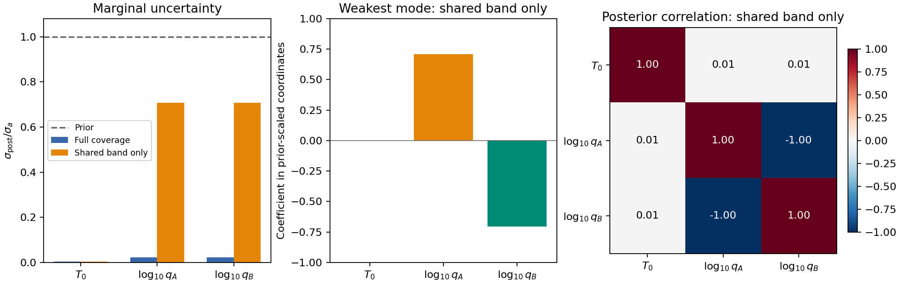

Spectral sensitivity, information, and degeneracy
=================================================

A spectrum can change strongly with two abundances while constraining only
their sum. A Jacobian shows the individual responses; a covariance and its
parameter modes show which combinations are measured. This tutorial uses
ExoJAX automatic differentiation and ``linear_gaussian_diagnostics`` to
forecast local uncertainties and compare wavelength coverage, following the
information-based approach discussed by Batalha & Wogan (2026),
`Exoplanet Atmosphere Spectral Sensitivity Analysis with PICASO: Jacobians,
Linear-Gaussian Approximations, and Information Content
<https://arxiv.org/abs/2609.22634>`_.

The example uses actual ``ArtEmisPure`` radiative transfer with explicitly
synthetic absorption cross sections. It needs no line lists, data downloads,
or retrieval run. Its numbers illustrate the method; they are not forecasts
for particular molecules, objects, or instruments.

Run the example
---------------

From a checkout with ExoJAX and Matplotlib installed:

.. code-block:: console

   JAX_PLATFORMS=cpu MPLBACKEND=Agg python examples/spectral_sensitivity.py

The script enables JAX 64-bit arithmetic and writes the two figures below
to ``documents/tutorials/spectral_sensitivity_files``. Use
``--output-dir /path/to/figures`` to choose another directory.
The :download:`complete example <../../examples/spectral_sensitivity.py>`
contains the imports, model setup, and plotting code.

Define the observation and parameter coordinates
------------------------------------------------

We model a 32-layer atmosphere from :math:`10^{-5}` to 10 bar with
:math:`T(P)=T_0(P/1\,\mathrm{bar})^{0.1}`, fixed gravity
:math:`10^3\,\mathrm{cm\,s^{-2}}`, and a fixed grey mass opacity of
:math:`0.01\,\mathrm{cm^2\,g^{-1}}`. The synthetic absorbers A and B have
the same molecular mass, 28 atomic mass units, and share a broad Gaussian
band centered at :math:`4400\,\mathrm{cm^{-1}}`. Each also has a distinct
narrow feature, at 4820 or :math:`4920\,\mathrm{cm^{-1}}`. The cross
sections are independent of pressure and temperature for this demonstration.

The parameters and independent Gaussian prior standard deviations are

.. math::

   \boldsymbol{\theta}=(T_0,\log_{10}q_A,\log_{10}q_B),\qquad
   \boldsymbol{\theta}_0=(1200\,\mathrm{K},-3,-3),\qquad
   \boldsymbol{\sigma}_a=(100\,\mathrm{K},0.5\,\mathrm{dex},0.5\,\mathrm{dex}),

where :math:`q_A` and :math:`q_B` are constant mass mixing ratios. The
Gaussian prior is defined in these coordinates; the abundance priors are
therefore lognormal in linear mixing ratio. A uniform-prior interval is not
a Gaussian standard deviation.

The model first calculates emission on 960 uniformly spaced wavenumber
cells over 4000--5000 :math:`\mathrm{cm^{-1}}`, then averages groups of
eight cells into 120 nonoverlapping top-hat observation bins. The output
is :math:`y_i=\langle F_{\tilde\nu}\rangle_i/F_*`, with the fixed scale
:math:`F_*=10^4\,\mathrm{erg\,s^{-1}\,cm^{-2}/(cm^{-1})}`. This is a
fixed unit conversion, not a fitted normalization. The figure displays bin
centers in wavelength, but the averages remain in wavenumber space.

.. literalinclude:: ../../examples/spectral_sensitivity.py
   :language: python
   :start-after: # BEGIN OBSERVED SPECTRUM
   :end-before: # END OBSERVED SPECTRUM
   :dedent: 4

The binning is inside ``observed_spectrum``, so ``jax.jacfwd`` differentiates
the complete observable. For your own model, include its convolution,
radial velocity, throughput, and sampling operations before taking the
Jacobian. In this example the only instrumental operation is the top-hat
average.

We assume independent, fixed Gaussian measurement errors
:math:`\sigma_{e,i}=0.003` on the scaled flux. This is an absolute error,
not a constant fractional error or a noise model differentiated with the
spectrum. No noisy realization is needed for this local forecast.

Compute the diagnostics
-----------------------

For the observation-space Jacobian
:math:`K_{ij}=\partial y_i/\partial\theta_j`, define diagonal error and
prior covariances :math:`S_e=\operatorname{diag}(\sigma_e^2)` and
:math:`S_a=\operatorname{diag}(\sigma_a^2)`. Linearizing the spectrum at
:math:`\boldsymbol{\theta}_0` gives

.. math::

   F=K^\mathsf{T}S_e^{-1}K,\qquad
   S_{\rm post}=(F+S_a^{-1})^{-1},\qquad
   A=S_{\rm post}F.

Here :math:`F` is the data Fisher matrix, :math:`S_{\rm post}` is the
local posterior covariance, and :math:`A` is the averaging kernel. The
diagonal of :math:`S_{\rm post}` gives the marginal variances after allowing
all three parameters to vary. The effective degrees of freedom and the
Gaussian entropy reduction in bits are

.. math::

   d=\operatorname{tr}(A),\qquad
   H=\frac{\ln\det S_a-\ln\det S_{\rm post}}{2\ln2}.

The factor :math:`\ln2` converts natural-log entropy to bits. This is a
covariance-based entropy reduction, not the realized posterior-to-prior
KL divergence, which also depends on the posterior mean displacement.

.. code-block:: python

   from exojax.utils.information import linear_gaussian_diagnostics

.. literalinclude:: ../../examples/spectral_sensitivity.py
   :language: python
   :start-after: # BEGIN DIAGNOSTICS
   :end-before: # END DIAGNOSTICS
   :dedent: 4

The function accepts a two-dimensional Jacobian, one noise standard
deviation per observation, and one prior standard deviation per parameter.
Both standard-deviation arrays must be finite and strictly positive.
It returns a dictionary containing ``fisher``, ``posterior_cov``,
``posterior_std``, ``averaging_kernel``, ``degrees_of_freedom``,
``information_bits``, ``singular_values``, and ``parameter_modes``.
Covariances and the averaging kernel use the original parameter coordinates.
Correlated errors or correlated priors are outside this function's scope.
The function can be JIT-compiled. Numerical input checks run on concrete
arrays; callers must ensure finite inputs and positive standard deviations
when supplying traced arrays. Differentiating the diagnostic function itself
has additional SVD restrictions, distinct from differentiating the forward
model to obtain its Jacobian.

Interpret sensitivities and weak modes
--------------------------------------

Temperature and log abundance have different units. To compare modes we
use the dimensionless Jacobian and parameter perturbations

.. math::

   B_{ij}=\frac{K_{ij}\sigma_{a,j}}{\sigma_{e,i}},\qquad
   z_j=\frac{\theta_j-\theta_{0,j}}{\sigma_{a,j}},\qquad
   B=U\,\operatorname{diag}(s_k)V^\mathsf{T}.

Each row of ``parameter_modes`` is a row of :math:`V^\mathsf{T}`, ordered
by descending ``singular_values``. A mode coordinate is
:math:`a_k=\boldsymbol{v}_k^\mathsf{T}\boldsymbol{z}`. Its prior variance
is one and its posterior variance is :math:`1/(1+s_k^2)`. Thus
:math:`s_k\ll1` identifies a combination dominated by its prior, while
:math:`s_k\gg1` indicates substantial information from the observations.
Mode signs are arbitrary. In terms of these singular values,

.. math::

   d=\sum_k\frac{s_k^2}{1+s_k^2},\qquad
   H=\frac12\sum_k\log_2(1+s_k^2).

These expressions also remain well defined for a rank-deficient Jacobian
because the proper Gaussian prior supplies finite variance in its null
space. The implementation uses the scaled decomposition to avoid directly
inverting the Fisher matrix or forming determinants.

   The lower panel shows :math:`B`, the flux response to a one-prior-standard-
   deviation parameter change in units of the noise standard deviation.
   The orange and green abundance curves overlap in the shared band.
   The shaded short-wavelength region contains the distinct features that
   separate the absorbers. Derivative curves describe local slopes, not
   finite excursions over the full prior.

Compare wavelength coverage
---------------------------

The full calculation uses all 120 bins. The restricted calculation retains
the 84 bins below :math:`4700\,\mathrm{cm^{-1}}`, or above approximately
:math:`2.128\,\mu\mathrm{m}`. It removes both distinct features while
keeping the shared band. Its retained bins have exactly the same errors as
in the full observation; there is no exposure-time redistribution. This
compares adding or removing measured channels at fixed sensitivity.

The script gives the following rounded results:

.. list-table::
   :header-rows: 1

   * - Quantity
     - Full coverage
     - Shared band only
   * - :math:`\sigma(T_0)` [K]
     - 0.390
     - 0.451
   * - :math:`\sigma(\log_{10}q_A)` [dex]
     - 0.0109
     - 0.3536
   * - :math:`\sigma(\log_{10}q_B)` [dex]
     - 0.0111
     - 0.3536
   * - Information :math:`H` [bits]
     - 19.765
     - 14.295
   * - Effective degrees of freedom :math:`d`
     - 2.999
     - 2.000
   * - Smallest singular value
     - 35.49
     - approximately zero

   Removing the distinct features leaves an almost unconstrained abundance
   difference mode and almost perfect abundance anticorrelation. Correlation
   entries are rounded to two decimals. The two abundance marginal errors
   remain below their individual prior errors because their sum is still
   measured.

At equal fiducial abundances, the shared band constrains their sum to first
order, while the normalized difference mode
:math:`(z_A-z_B)/\sqrt{2}` retains essentially its unit prior variance.
Each individual abundance therefore has a marginal error near
:math:`0.5/\sqrt{2}=0.354` dex. This distinction explains why a small
individual derivative, a small marginal error, and a weak joint mode are
different diagnostics.

Opposite perturbations in log abundance leave the shared-band spectrum
unchanged to first order at this state. Finite perturbations need not do so;
the unconstrained local mode does not imply a flat nonlinear likelihood
along a straight line in log-abundance coordinates.

Limits and applying this to a retrieval
---------------------------------------

Replace the synthetic cross sections with your usual ExoJAX opacity
calculator and choose a fiducial state and Gaussian prior in the exact
coordinates passed to ``jax.jacfwd``. Include nuisance parameters such as
calibration or radius when they affect the intended observation; fixing
them can make a forecast too optimistic. If you change spectral binning,
propagate the measurement covariance with the same binning operator.
Averaging independent equal-error samples reduces their standard deviation
by the square root of the number averaged; overlapping kernels may produce
correlations that this diagonal-error interface cannot represent.

This is a local linear Gaussian forecast. Automatic differentiation computes
local derivatives accurately, but does not remove nonlinearity, multimodality,
physical boundaries, upper limits, or forward-model error. In particular,
the broad uncertainty along the restricted abundance mode need not produce
a Gaussian posterior in an actual retrieval. Compare with posterior sampling
when those effects matter, and recompute at other plausible fiducial states
before drawing observing-strategy conclusions.
