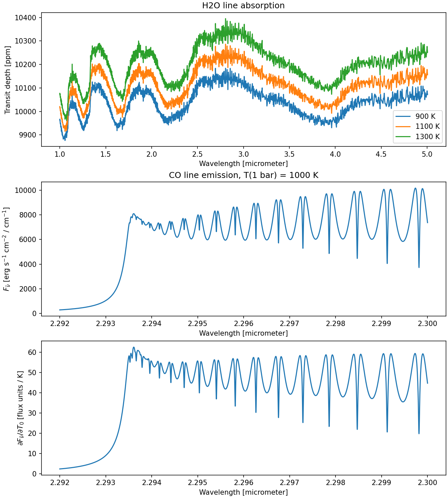

Spectra from Small Precomputed Opacity Tables
=============================================

This tutorial calculates a water transmission spectrum and a
high-resolution CO emission spectrum, including its temperature
derivative. The opacity tables are already computed: you can start with
the radiative-transfer calculation without obtaining a molecular line
list or building PreMODIT.

Both examples include one line absorber. They are small teaching models
that show how temperature changes a spectrum. The H2/He background in
the transmission example sets the mean molecular weight; CIA, scattering,
and other absorbers are omitted.

The example adapts the existing
:doc:`ckd_transpure_loadonly` and :doc:`../userguide/save_diffgrid`
workflows. Their opacity loaders and radiative-transfer calculators are
unchanged. The existing retrieval tutorials remain useful next steps;
they require additional data preparation and inference work.

Get the data and run
--------------------

See :doc:`../opacity_data` for the release status, provenance, and
download details. After the data is published, run the following from an
ExoJAX checkout using the ExoJAX version recorded in the dataset
manifest:

.. code-block:: console

    python examples/starter_opacity.py --output starter_opacity.png

The script fetches just ``h2o-ckd-v1`` and ``co-diffgrid-v1``, verifies
their downloads, and saves a figure with three panels. Omit ``--output``
to display the figure interactively. Download the complete script:
:download:`starter_opacity.py <../../examples/starter_opacity.py>`.

   Output from the initial local build. Both atmosphere models include
   molecular line opacity only.

For tables prepared locally before publication, point to the directory
containing the two dataset directories:

.. code-block:: console

    python examples/starter_opacity.py \
        --data-root documents/_build/opacity-data \
        --output starter_opacity.png

This local mode reads the supplied files directly. The hosted download
path uses ``fetch_starter_opacity`` to verify the manifest's checksums.
The script enables ``jax_enable_x64`` before loading either table. Keep
the CO NPZ file and its sibling metadata JSON together, and leave the
DiffGrid loader's strict version and precision checks enabled.

Water transmission with CKD
---------------------------

The water dataset retains ExoMolOP's R = 1000 bands and quadrature in
the approximately 1--5 micrometer interval. It covers 500--1500 K and
10\ :sup:`-5`--10 bar. ``OpaCKD.from_external`` loads its local HDF5
file; no upstream download is needed.

The function below uses 30 atmospheric layers and a constant water mass
mixing ratio of 0.001. ``ArtTransPure.run_ckd`` returns the squared
transit radius normalized by the bottom radius squared. Converting this
to transit depth requires the stellar radius, supplied here explicitly.

.. literalinclude:: ../../examples/starter_opacity.py
   :language: python
   :pyobject: h2o_transmission

The script plots 900, 1100, and 1300 K isothermal models. Inspect the
water bands and how the larger atmospheric scale height changes their
transit depths. Change the temperatures within the supplied table's
range to explore this effect. Each plotted CKD point represents a
spectral band; it is not an individually resolved line.

CO emission with DiffGrid
-------------------------

The CO dataset uses 3500 wavenumber samples across 2.292--2.300
micrometers, 17 inverse-temperature nodes covering 500--1500 K, and
16 fixed representative layer pressures from 0.1 to 10 bar. The table
omits wings from CO lines centered outside this spectral interval.
The following model reconstructs those pressures:

.. literalinclude:: ../../examples/starter_opacity.py
   :language: python
   :pyobject: co_atmosphere

The script calls ``co.check_pressure_grid`` once before the compiled or
differentiated calculation. Altering these pressures requires rebuilding
the table. The emission calculation uses
:math:`T(P) = T_0 (P / 1\,\mathrm{bar})^{0.08}` and a CO mass mixing
ratio of 0.001:

.. literalinclude:: ../../examples/starter_opacity.py
   :language: python
   :pyobject: co_emission

This solver adds thermal emission from the modeled layers and assumes no
incoming flux at the lower boundary. Without continuum opacity, the
line-only spectrum need not resemble a full planetary photosphere.

The plotted flux is per unit wavenumber, even though its horizontal axis
is wavelength. At :math:`T_0 = 1000` K, every layer remains within the
table's temperature range. Values of :math:`T_0` between 900 and 1100 K
also remain within that range for this particular pressure grid and
power-law exponent.

Differentiate the spectrum
--------------------------

``jax.jvp`` evaluates the CO spectrum and its derivative with respect to
:math:`T_0` in one call. A unit tangent gives
:math:`\partial F_{\tilde\nu}/\partial T_0` per kelvin at each
wavenumber. This includes both the temperature dependence of the opacity
and of the thermal source function.

.. literalinclude:: ../../examples/starter_opacity.py
   :language: python
   :start-after: # BEGIN TEMPERATURE DERIVATIVE
   :end-before: # END TEMPERATURE DERIVATIVE
   :dedent: 4

Compare the flux and derivative panels to see where CO responds most
strongly to a change in temperature. Keep all layer temperatures inside
the saved range when experimenting or defining an inference prior.

Next steps
----------

Use :doc:`transmission_ckd_exomolop` to load other ExoMolOP tables,
:doc:`../userguide/diffgrid` to construct and validate a custom DiffGrid,
and :doc:`../userguide/save_diffgrid` to save it for later use.
The :doc:`ckd_transpure_loadonly` and :doc:`diffgrid_nuts_retrieval`
tutorials extend related models to HMC-NUTS retrievals. Their data
preparation and atmospheric settings differ from these small starter
datasets.
