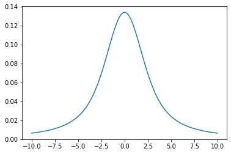
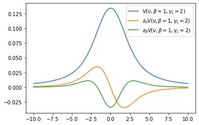
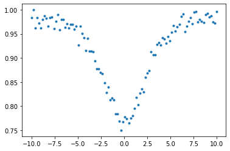
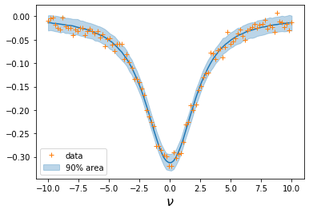
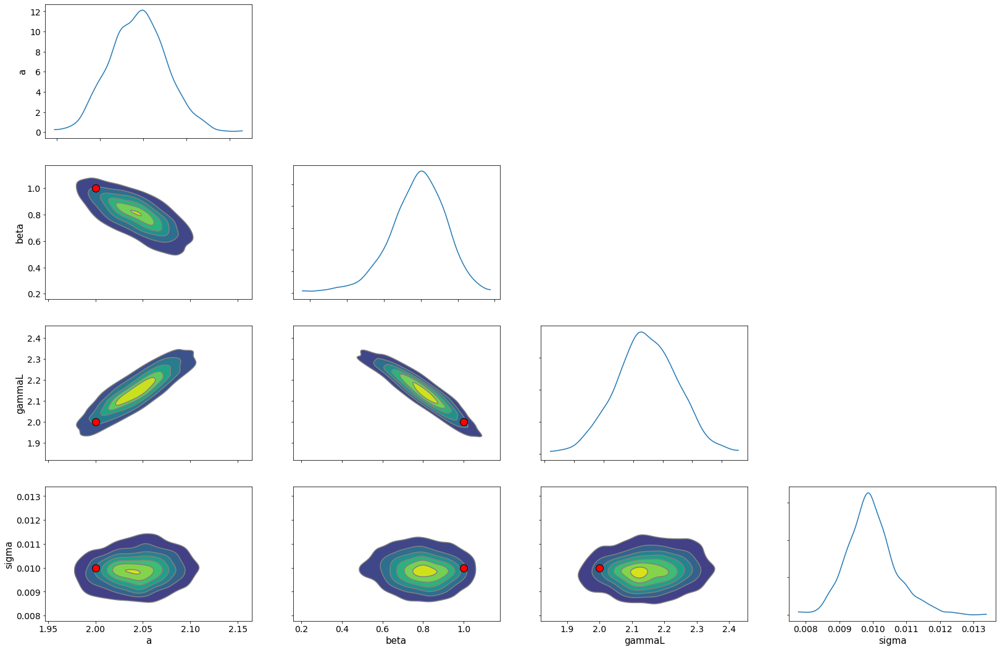

Fitting a Voigt Profile
===========================================
*Update: May 10/2021, Hajime Kawahara*

Let’s compute
`the Voigt profile <https://en.wikipedia.org/wiki/Voigt_profile>`_
:math:`V(\nu, \beta, \gamma_L)`
using exojax!
:math:`V(\nu, \beta, \gamma_L)` is a convolution of a Gaussian
with a STD of :math:`\beta` and a Lorentian with a gamma parameter of
:math:`\gamma_L`.

.. code:: ipython3

    from exojax.spec import voigt
    import jax.numpy as jnp
    import matplotlib.pyplot as plt
      
.. code:: ipython3

    nu=jnp.linspace(-10,10,100)
    plt.plot(nu, voigt(nu,1.0,2.0)) #beta=1.0, gamma_L=2.0

The function `voigt <../exojax/exojax.spec.html#exojax.spec.lpf.voigt>`_ is `vmapped <https://jax.readthedocs.io/en/latest/jax.html#jax.vmap>`_ for nu (input=0), therefore a bit hard
to handle when you want to differentiate. Instead, you can use
`voigtone <../exojax/exojax.spec.html#exojax.spec.lpf.voigtone>`_, which is not vmapped for all of the input arguments.

.. code:: ipython3

    from exojax.spec import voigtone 
    from jax import grad, vmap
    
    dvoigt_nu=vmap(grad(voigtone,argnums=0),(0,None,None),0) #derivative by nu
    dvoigt_beta=vmap(grad(voigtone,argnums=1),(0,None,None),0) #derivative by beta

.. code:: ipython3

    plt.plot(nu, voigt(nu,1.0,2.0),label="$V(\\nu,\\beta=1,\\gamma_L=2)$")
    plt.plot(nu, dvoigt_nu(nu,1.0,2.0),label="$\\partial_\\nu V(\\nu,\\beta=1,\\gamma_L=2)$")
    plt.plot(nu, dvoigt_beta(nu,1.0,2.0),label="$\\partial_\\beta V(\\nu,\\beta=1,\\gamma_L=2)$")
    plt.legend()

HMC-NUTS of a simple absorption model
-------------------------------------

Next, we try to fit a simple absorption model to mock data. The
absorption model is

:math:`e^{-a V(\nu,\beta,\gamma_L)}`

.. code:: ipython3

    def absmodel(nu,a,beta,gamma_L):
        return jnp.exp(-a*voigt(nu,beta,gamma_L))

Making a mock data and adding a noise…

.. code:: ipython3

    from numpy.random import normal
    data=absmodel(nu,2.0,1.0,2.0)+normal(0.0,0.01,len(nu))
    plt.plot(nu,data,".")

Then, let's perform a HMC-NUTS.
	   
.. code:: ipython3

    import arviz
    import numpyro.distributions as dist
    import numpyro
    from numpyro.infer import MCMC, NUTS
    from numpyro.infer import Predictive
    from numpyro.diagnostics import hpdi

This model is not sophisticated in terms of priors..., but
   
.. code:: ipython3

    def model_c(nu,y):
        sigma = numpyro.sample('sigma', dist.Exponential(1.0))
        a = numpyro.sample('a', dist.Exponential(1.0))
        beta = numpyro.sample('beta', dist.Exponential(1.0))
        gamma_L = numpyro.sample('gammaL', dist.Exponential(1.0))
        mu=absmodel(nu,a,beta,gamma_L)
        numpyro.sample('y', dist.Normal(mu, sigma), obs=y)

.. code:: ipython3

    from jax import random
    rng_key = random.PRNGKey(0)
    rng_key, rng_key_ = random.split(rng_key)
    num_warmup, num_samples = 1000, 2000

.. code:: ipython3

    kernel = NUTS(model_c,forward_mode_differentiation=True)
    mcmc = MCMC(kernel, num_warmup, num_samples)
    mcmc.run(rng_key_, nu=nu, y=data)

.. parsed-literal::

    sample: 100%|██████████| 3000/3000 [00:33<00:00, 90.50it/s, 15 steps of size 1.69e-01. acc. prob=0.95] 

Anyway, it works.
    
.. code:: ipython3

    
    posterior_sample = mcmc.get_samples()
    pred = Predictive(model_c,posterior_sample)
    predictions = pred(rng_key_,nu=nu,y=None)
                                                                                        
    median_mu = jnp.median(predictions["y"],axis=0)
    hpdi_mu = hpdi(predictions["y"], 0.9)

.. code:: ipython3

    fig, ax = plt.subplots(nrows=1, ncols=1)                                                 
    ax.plot(nu,median_mu,color="C0")
    ax.plot(nu,data,"+",color="C1",label="data")
    ax.fill_between(nu, hpdi_mu[0], hpdi_mu[1], alpha=0.3, interpolate=True,color="C0",
                    label="90% area")
    plt.xlabel("$\\nu$",fontsize=16)
    plt.legend()

We got a posterior sampling.

.. code:: ipython3

    refs={};refs["sigma"]=0.01;refs["a"]=2.0;refs["beta"]=1.0;refs["gammaL"]=2.0
    arviz.plot_pair(arviz.from_numpyro(mcmc),kind='kde',\
                    divergences=False,marginals=True,reference_values=refs,\
                   reference_values_kwargs={'color':"red", "marker":"o", "markersize":12})
    plt.show()

To optimize this model, for instance using `ADAM <https://arxiv.org/abs/1412.6980>`_, see ":doc:`optimize_voigt`".
