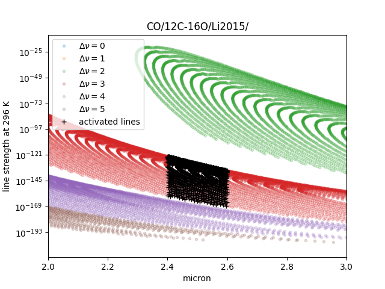

ExoMol, HITEMP, HITRAN
--------------------------------------

*November 4th (2022) Hajime Kawahara*

Since version 1.2, the standard molecular database I/O for ExoMol, HITEMP, and HITRAN was shared with the radis team. 
We moved the I/O for these database to `exojax.spec.api <../exojax/exojax.spec.html#module-exojax.spec.api>`_.

ExoMol
==========

How to load ExoMol CO database
^^^^^^^^^^^^^^^^^^^^^^^^^^^^^^^^^^^

.. code:: ipython
	
	>>> from exojax.spec.api import MdbExomol
	>>> mdb = MdbExomol(".database/CO/12C-16O/Li2015", nurange=[4200.0, 4300.0])

We can check the attribute_names in mdb by 

.. code:: ipython
    
    >>> attribute_names = [attr_name for attr_name, attr_value in mdb.__dict__.items() if not callable(attr_value) and not attr_name.startswith("__")]
    >>> print(attribute_names)
    ['dbtype', 'path', 'exact_molecule_name', 'database', 'bkgdatm', 'Tref', 'gpu_transfer', 'Ttyp', 'broadf', 'simple_molecule_name', 'molmass', 'skip_optional_data', 'activation', 'name', 'molecule', 'local_databases', 'extra_params', 'downloadable', 'format', 'engine', 'tempdir', 'ds', 'verbose', 'parallel', 'nJobs', 'batch_size', 'minimum_nfiles', 'crit', 'margin', 'nurange', 'wmin', 'wmax', 'states_file', 'pf_file', 'def_file', 'broad_file', 'isotope_fullname', 'n_Texp_def', 'alpha_ref_def', 'gQT', 'T_gQT', 'QTref', 'trans_file', 'num_tag', 'elower_max', 'QTtyp', 'df_load_mask', 'A', 'nu_lines', 'elower', 'jlower', 'jupper', 'line_strength_ref', 'gpp', 'alpha_ref', 'n_Texp', 'gamma_natural', 'dev_nu_lines', 'logsij0']

Some opacity calculator (currently only PreMODIT) does not use some arrays on a GPU device. 
Switch gpu_transfer off in this case. Then, we can save the use of the device memory.

.. code:: ipython
	
	>>> mdb = MdbExomol(".database/CO/12C-16O/Li2015", nurange=[4200.0, 4300.0], gpu_transfer=False)
	>>> mdb.logsij0
		Traceback (most recent call last):
  		 File "<stdin>", line 1, in <module>
		 AttributeError: logsij0

This table is a short summary of the line information. "on" means gpu_transfer = True, off corresponds to False. 

+-----------------------+-------------+----+------+
|**quantity**           |**instance** |unit|off/on|
+-----------------------+-------------+----+------+
|line center            |nu_lines     |cm-1|np/np |
+-----------------------+-------------+----+------+
|lower state energy     |elower       |cm-1|np/jnp|
+-----------------------+-------------+----+------+
|Einstein coefficient   |A            |s-1 |np/jnp|
+-----------------------+-------------+----+------+
|reference line strength|Sij0         |cm  |np/jnp|
+-----------------------+-------------+----+------+
|log_e Sij0             |logsij0      |    |-/jnp |
+-----------------------+-------------+----+------+
|statistical weight     |gupper       |    |np/jnp|
+-----------------------+-------------+----+------+
|J_lower                |jlower       |    |np/jnp|
+-----------------------+-------------+----+------+
|J_upper                |jupper       |    |np/jnp|
+-----------------------+-------------+----+------+
|temperature exponent   |n_Tref       |    |np/jnp|
+-----------------------+-------------+----+------+
|alpha_ref (gamma0)     |alpha_ref    |    |np/jnp|
+-----------------------+-------------+----+------+
|natural broadening     |gamma_natural|cm-1|np/jnp|
+-----------------------+-------------+----+------+
|line center            |dev_nu_lines |cm-1|-/jnp |
+-----------------------+-------------+----+------+

HITEMP
======================

How to load HITEMP CO database
^^^^^^^^^^^^^^^^^^^^^^^^^^^^^^^^^^^

Here are examples for loading CO from HITEMP.

.. code:: ipython
	
	>>> from exojax.spec.api import MdbHitemp
	>>> MdbHitemp("CO", nurange=[4200.0, 4300.0])
	>>> MdbHitemp(".database/CO/", nurange=[4200.0, 4300.0])
	>>> MdbHitemp(".database/05/", nurange=[4200.0, 4300.0])
	
The style used in ExoJAX 1 is also acceptable (not recommended): 

.. code:: ipython
	
	>>> MdbHitemp(".database/CO/05_HITEMP2019/05_HITEMP2019.par.bz2", nurange=[4200.0, 4300.0])

If you have the error like,

.. code:: sh

	Please fix/delete the radis.json entry, change the `databank_name`, or change the default local databases path entry 'DEFAULT_DOWNLOAD_PATH' in `radis.config` or ~/radis.json

remove radis.json and retry it.

+-----------------------+-------------+----+------+
|**quantity**           |**instance** |unit|off/on|
+-----------------------+-------------+----+------+
|line center            |nu_lines     |cm-1|np/np |
+-----------------------+-------------+----+------+
|line center            |dev_nu_lines |cm-1|-/jnp |
+-----------------------+-------------+----+------+
|lower state energy     |elower       |cm-1|np/jnp|
+-----------------------+-------------+----+------+
|natural broadening     |gamma_natural|cm-1|np/jnp|
+-----------------------+-------------+----+------+
|air pressure broadening|gamma_air    |cm-1|np/jnp|
+-----------------------+-------------+----+------+
|self broadning         |gamma_self   |cm-1|np/jnp|
+-----------------------+-------------+----+------+
|Einstein coefficient   |A            |s-1 |np/jnp|
+-----------------------+-------------+----+------+
|reference line strength|Sij0         |cm  |np/jnp|
+-----------------------+-------------+----+------+
|log_e Sij0             |logsij0      |    |-/jnp |
+-----------------------+-------------+----+------+
|statistical weight     |gpp          |    |np/jnp|
+-----------------------+-------------+----+------+
|temperature exponent   |n_air        |    |np/jnp|
+-----------------------+-------------+----+------+

Isotope
^^^^^^^^^^^^^^^^^^^^^^^^^^^^^^^^^^^

HITEMP includes all of the isotopes.  To know which isotopes are included in mdb, use uniqiso instance.

.. code:: ipython
	
	>>> mdb = MdbHitemp(".database/CO/", nurange=[4200.0, 4210.0], crit=1.e-30)
	>>> mdb.uniqiso #-> [1,2,3,4,6]

You can know what isotope name "isotope=1" corresponds to

.. code:: ipython
	
	>>> mdb.exact_isotope_name(1) #-> (12C)(16O)

Loading HITEMP for Each Isotope
^^^^^^^^^^^^^^^^^^^^^^^^^^^^^^^^^^^^^^^

Sometimes it's useful to take it out for each isotope.
To load C12 O16 (isotope = 1), use the isotope option. 
"isotope" is the isotope number used in HITRAN/HITEMP, which starts from 1.

.. code:: ipython
	
	>>> mdb = MdbHitemp(".database/CO/", nurange=[4200.0, 4300.0], isotope = 1)

Parition Function (Ratio) for Each Isotope
^^^^^^^^^^^^^^^^^^^^^^^^^^^^^^^^^^^^^^^^^^^^^^^^^^^

In MdbHitemp, QT_interp and qr_interp have the isotope option. 
Here is an example of specifying an isotope for the partition function computation.

.. code:: ipython
	
	>>> T = 1000 #K
	>>> isotope = 1
	>>> QT = mdb.QT_interp(isotope, T) # partition function Q(T) for isotope=1
	>>> q_ratio = mdb.qr_interp(isotope, T) # partition function ratio Q(T)/Q(Tref)

Direct Load of the HITRAN parameter file (.par)
^^^^^^^^^^^^^^^^^^^^^^^^^^^^^^^^^^^^^^^^^^^^^^^^^^^^

We can directly use the HITRAN parameter file (.par file). 
The following is an example of reading .par directly:

.. code:: ipython
	
	>>> from exojax.spec.api import MdbHitemp
	>>> from exojax.utils.grids import wavenumber_grid
	>>> nus, wav, res = wavenumber_grid(22920.0,23100.0,20000,unit="AA",xsmode="modit")
	xsmode =  modit
	xsmode assumes ESLOG in wavenumber space: mode=modit
	>>> mdb = MdbHitemp("CO",nus,parfile="05_HITEMP_SAMPLE.par")

Optional Quantum States
^^^^^^^^^^^^^^^^^^^^^^^^^^^^^^^^

As in the case of MdbExomol, we can use vibrational quantum numbers and electronic states for filtering
See " :doc:`qstates` " for the use of the optional quantum states. 

HITRAN
======================

The mdb for HITRAN is currently functioning much almost the same as MdbHITEMP. 
However, due to the possibility of implementing different functions in the future, separate classes are provided.

How to load HITRAN CO database
^^^^^^^^^^^^^^^^^^^^^^^^^^^^^^^^^^^

.. code:: ipython
	
	>>> from exojax.spec.api import Mdbhitran
	>>> Mdbhitran(".database/CO/", nurange=[4200.0, 4300.0])
	>>> Mdbhitran(".database/05/", nurange=[4200.0, 4300.0])
	

The style used in ExoJAX 1 is also acceptable (not recommended): 

.. code:: ipython
	
	>>> Mdbhitran(".database/CO/05_hit12.par", nurange=[4200.0, 4300.0])

DataFrames
===========================================

ExoJAX mdb class inherits DataFrame of the common API when calling "inherit_dataframe=True", in "df" instance as. 
This DataFrame is not masked by "nurange" and/or "crit" options and has the format of Vaex lazy I/O.

.. code:: python

	>>> mdb = MdbExomol(".database/CO/12C-16O/Li2015", nurange=[4200.0, 4300.0], inherit_dataframe=True)
	>>> mdb.df
	#        i_upper    i_lower    A          nu_lines      gup    jlower    jupper    elower      Sij0
	0        84         42         1.155e-06  2.405586      3      0         1         66960.7124  3.811968898414225e-164
	1        83         41         1.161e-06  2.441775      3      0         1         65819.903   9.663028103692631e-162
	2        82         40         1.162e-06  2.477774      3      0         1         64654.9206  2.7438392479197905e-159
	3        81         39         1.159e-06  2.513606      3      0         1         63465.8042  8.73322833971394e-157
	4        80         38         1.152e-06  2.549292      3      0         1         62252.5793  3.115220404216648e-154
	...      ...        ...        ...        ...           ...    ...       ...       ...         ...
	125,491  306        253        7.164e-10  22147.135424  15     6         7         80.7354     1.8282485593637477e-31
	125,492  474        421        9.852e-10  22147.86595   23     10        11        211.4041    2.0425455665383687e-31
	125,493  348        295        7.72e-10   22147.897299  17     7         8         107.6424    1.9589545250222689e-31
	125,494  432        379        9.056e-10  22148.262711  21     9         10        172.978     2.0662209116961706e-31
	125,495  390        337        8.348e-10  22148.273111  19     8         9         138.3903    2.0387827253771594e-31

For instance, if you want to call "i_upper", use "values" like:

.. code:: python

	>>> i_upper = mdb.df.i_upper.values
	>>> i_upper
	array([ 84,  83,  82, ..., 348, 432, 390])

Notice the above array is not masked. So, the length is different from for instance "mdb.nu_lines".

.. code:: python

	>>> len(i_upper)
	125496
	>>> len(mdb.nu_lines)
	771

Quantum States Filtering (ExoMol/HITEMP) 
=============================================

The only quantum state needed to calculate the cross section is the rotational quantity index. 
However, some databases also describe vibrational quantum numbers and electronic states. 
We can use this information for filtering.

When we would like to filter the lines based on vibration states (v), 
we can mask the lines using Data Frame. 

To do so, we do not activate mdb when initialization. 
Also, we need to load the optional quantum states. 
Here is an example for the initialization. 

.. code:: ipython
	
    >>> from exojax.utils.grids import wavenumber_grid
    >>> from exojax.spec import api
	
    >>> nus, wav, res = wavenumber_grid(24000.0, 26000.0, 1000, unit="AA")
    >>> mdb = api.MdbExomol(""CO/12C-16O/Li2015/"", nus, optional_quantum_states=True, activation=False)

Then, let's check DataFrame. 

.. code:: ipython
	
    >>> print(mdb.df)

You find the following fields are available for Li2015:

- i_upper    i_lower    A          nu_lines      gup    jlower    jupper    elower      v_l    v_u    kp_l    kp_u    Sij0

For instance, v_l means the rotational quantum number (nu) for the lower state, v_u the upper state. 
We would use the lines with the condition delta v = 3. Make the mask using DataFrame.

.. code:: ipython
	
    >>> mask = (mdb.df["v_u"] - mdb.df["v_l"] == 3) 

Activate the mdb with the mask we made. The activation includes making the instances (such as mdb.nu_lines ... ), computing broadening parameters etc.  

.. code:: ipython
	
    >>> mdb.activate(mdb.df, mask)

Then, we can use mdb as usual. This is a plot of the activated lines and all of the lines in DataFrame.
    

See also " :doc:`../tutorials/Fortrat` "
