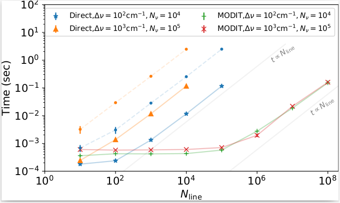

Benchmark
===========================

Direct LPF vs MODIT
--------------------

Here is the benchmark for LPF (Direct) vs MODIT as a function of the number of the lines. Because the computation time depends on both the actual computation on the GPU device and data transfer from the main memory to the memory on the GPU, we show two different cases with and without data transfer to the GPU device for the direct LPF. The HMC−NUT fitting corresponds to the latter case because it reuses the values in the GPU memory many times. The computation time with data transfer was approximately ten times slower than that without transfer. For the direct LPF, the computation time is approximately proportional to the number of lines and the wavenumber. The mean computation time without transfer was ~0.1 ns per line per wavenumber bin using NVIDIA/DGX A100. The MODIT algorithm exhibits almost no dependence on the number of lines until Nline ~100,000 and converges to a linear dependence for larger Nlines. This trend is consistent with the results of van den Bekerom & Pannier (2021). See Figures 3 and 11 in their paper. Notably, MODIT does not depend significantly on the number of wavenumber bins. For a large number of lines, the calculation of the lineshape density Sjk takes so much longer than the convolution step that it dominates the computation time. For a small number of lines, this is probably because batch computation tends to be advantageous for FFT in GPU computations.

(taken from Section 2.6 in
`Paper I <https://iopscience.iop.org/article/10.3847/1538-4365/ac3b4d>`_
)

MODIT vs PreMODIT
----------------------

in prep