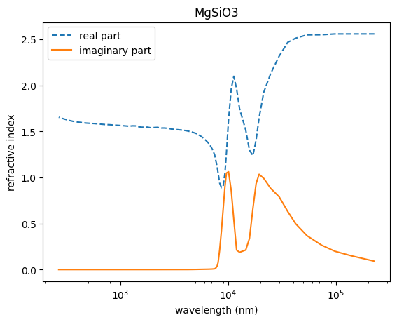

Comparison the AM geometric opacity with PieMieScatt
====================================================

We import ``pdb`` with ``MgSiO3`` to use the refractive index.

.. code:: ipython3

    from exojax.database.pardb  import PdbCloud
    miedir = "/home/kawahara/exojax/documents/tutorials/.database/particulates/virga"
    #miedir = "/home/exoplanet01/exojax/documents/tutorials/.database/particulates/virga"
    pdb = PdbCloud("MgSiO3", path=miedir)

.. parsed-literal::

    /home/kawahara/exojax/documents/tutorials/.database/particulates/virga/virga.zip  exists. Remove it if you wanna re-download and unzip.
    Refractive index file found:  /home/kawahara/exojax/documents/tutorials/.database/particulates/virga/MgSiO3.refrind
    Miegrid file exists: /home/kawahara/exojax/documents/tutorials/.database/particulates/virga/miegrid_lognorm_MgSiO3.mg.npz

``pdb`` has the information of refractive index in
``pdb.refraction_index`` and ``pdb.refraction_index_wavelength_nm``.
These values were taken from ``VIRGA``.

Notice the refactive index has the form of :math:`m = n + ik`.

.. code:: ipython3

    m = pdb.refraction_index
    mwav = pdb.refraction_index_wavelength_nm
    
    import matplotlib.pyplot as plt
    plt.plot(mwav,m.real, label="real part", ls="dashed")
    plt.plot(mwav,m.imag, label="imaginary part")
    plt.legend()
    plt.xscale("log")
    plt.xlabel("wavelength (nm)")
    plt.ylabel("refractive index")
    plt.title("MgSiO3")
    plt.savefig("mgsio3_refractive_index.png")
    #plt.savefig("mgsio3_refractive_index.pdf")
    plt.show()

Let’s compute the opacity of the condensate for the inicident light of 2
:math:`\mu\mathrm{m}`.

.. code:: ipython3

    imie = 195
    print("Incident light: " ,mwav[imie],"nm = ", mwav[imie]*1.e-3,"um")

.. parsed-literal::

    Incident light:  268.0 nm =  0.268 um

.. code:: ipython3

    rg_um = 0.05  # 0.1um = 100nm
    sigmag = 2.0
    cm2um = 1.0e4
    cm2nm = 1.0e7
    
    rg = rg_um / cm2um  # in cgs
    rg_nm = rg * cm2nm
    
    N0 = 1.0 # cm-3

.. code:: ipython3

    from PyMieScatt import MieQ
    MieQ(m[imie], mwav[imie], 2.0 * rg_nm, asDict=True)

.. parsed-literal::

    {'Qext': 0.6246146481677305,
     'Qsca': 0.6222127380166314,
     'Qabs': 0.0024019101510991403,
     'g': 0.31392139184771023,
     'Qpr': 0.4292887594241749,
     'Qback': 0.3552936962793397,
     'Qratio': 0.5710164298658941}

``PyMieScatt.Mie_Lognormal`` can be used to compute the extinction
coefficient [Mm-1] etc. Note that the integration range lower - upper
[nm] is very important. Be sure if the range is sufficient to cover the
main body of the lognormal distribution

.. code:: ipython3

    from PyMieScatt import Mie_Lognormal
    coeff = Mie_Lognormal(
        m[imie], mwav[imie], sigmag, 2.0 * rg_nm, N0, asDict=True, lower=1.0, upper=1000.0
    )  # geoMean is a diameter in PyMieScatt

.. code:: ipython3

    coeff

.. parsed-literal::

    {'Bext': 0.05524251821735671,
     'Bsca': 0.05497278262294254,
     'Babs': 0.0002697355944141708,
     'bigG': 0.6015827577846368,
     'Bpr': 0.022171840043951584,
     'Bback': 0.064842639707528,
     'Bratio': 0.027327967027152126}

Do not forget the unit of ``Bext``, ``Bsca``, and ``Babs`` is
:math:`\mathrm{Mm}^{-1}` i.e. the inverse of mega meter. To convert the
values in cgs (:math:`\mathrm{cm^{-1}}`), just multiply :math:`10^{-8}`.

.. code:: ipython3

    beta_ext = coeff["Bext"]*1.e-8 #Mm-1 to cm-1 

Computes the optical depth for L = 10 km and
:math:`n = 10^7 \mathrm{cm^{-3}}`

.. code:: ipython3

    from exojax.atm.amclouds import geometric_radius
    rgeo = geometric_radius(rg, sigmag)

Assuming the large size limit (:math:`Q_e = 2`), we estimate the
extinction coefficient from the geometric radius.

.. code:: ipython3

    import jax.numpy as jnp
    Qe = 2 # large size limit
    Qe*jnp.pi*rgeo**2 

.. parsed-literal::

    Array(4.106162e-10, dtype=float32, weak_type=True)

This is close to the extinction coefficient computed using
``PyMieScatt``.

.. code:: ipython3

    beta_ext 

.. parsed-literal::

    5.524251821735671e-10

