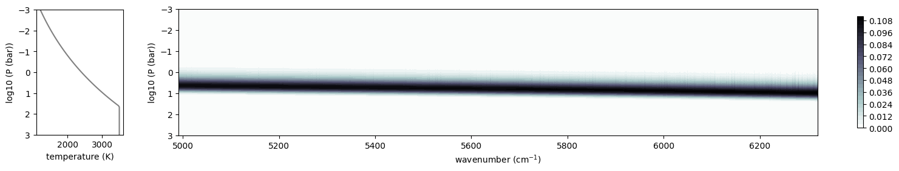

FeH line list from Hargreaves et al. (2010) (customapi)
=======================================================

Hargreaves et al. (2010), hereafter **Harg2010**, is a FeH line list at
2200 K for the :math:`E^4 \Pi_i–A^4 \Pi_i` FeH transition near
:math:`1.6 \mu \mathrm{m}` based on experimental measurements and an ab
initio calculation of the band strength.

It is used in Sonora models (e.g., `Marley et al.,
2021 <https://ui.adsabs.harvard.edu/abs/2021ApJ...920...85M/abstract>`__;
`Morley et al.,
2024 <https://ui.adsabs.harvard.edu/abs/2024ApJ...975...59M/abstract>`__)
and has been validated in several brown dwarf atmosphere studies.

.. code:: ipython3

    from jax import config
    config.update("jax_enable_x64", True)
    
    database_dir = ".database/"

Since the wavenumber range of the Harg2010 list is from 4991 to 6320
cm-1, please set the wavenumber grid to cover this range.

.. code:: ipython3

    from exojax.utils.grids import wavenumber_grid  
    nu_grid, wav, res = wavenumber_grid(4991, 6320, 30000, "premodit", unit="cm-1")  

.. parsed-literal::

    xsmode =  premodit
    xsmode assumes ESLOG in wavenumber space: xsmode=premodit
    Your wavelength grid is in ***  descending  *** order
    The wavenumber grid is in ascending order by definition.
    Please be careful when you use the wavelength grid.

.. parsed-literal::

    /home/yuikasagi/exojax/src/exojax/utils/grids.py:170: UserWarning: Resolution may be too small. R=127069.76131906603
      warnings.warn("Resolution may be too small. R=" + str(resolution), UserWarning)

Before loading the Harg2010 line list, we set ExoMol database to use its
partition function.

As of May 2025, the current ExoMol uses the partition function from
MoLLIST by Bernath et al. (2020). For the FeH line list, it uses list
from Wende et al. (2018), which is based on the list by Dulick et
al. (2003).

.. code:: ipython3

    from exojax.database.api  import MdbExomol
    
    mdb_exomol = MdbExomol(database_dir + "FeH/56Fe-1H/MoLLIST", nurange=nu_grid)
    mdb_exomol_noactivation =  MdbExomol(database_dir + "FeH/56Fe-1H/MoLLIST", nurange=nu_grid, activation=False)

.. parsed-literal::

    radis== 0.15.2
    HITRAN exact name= (56Fe)H
    HITRAN exact name= (56Fe)H
    radis engine =  pytables
    		 => Downloading from http://www.exomol.com/db/FeH/56Fe-1H/56Fe-1H__H2.broad

.. parsed-literal::

    /home/yuikasagi/exojax/src/exojax/spec/api.py:135: UserWarning: The current version of radis does not support broadf_download (requires >=0.16).
      warnings.warn(msg, UserWarning)
    /home/yuikasagi/exojax/src/exojax/utils/molname.py:197: FutureWarning: e2s will be replaced to exact_molname_exomol_to_simple_molname.
      warnings.warn(
    /home/yuikasagi/exojax/src/exojax/utils/molname.py:91: FutureWarning: exojax.utils.molname.exact_molname_exomol_to_simple_molname will be replaced to radis.api.exomolapi.exact_molname_exomol_to_simple_molname.
      warnings.warn(
    /home/yuikasagi/exojax/src/exojax/utils/molname.py:63: UserWarning: No isotope number identified.
      warnings.warn("No isotope number identified.", UserWarning)
    /home/yuikasagi/exojax/src/exojax/utils/molname.py:91: FutureWarning: exojax.utils.molname.exact_molname_exomol_to_simple_molname will be replaced to radis.api.exomolapi.exact_molname_exomol_to_simple_molname.
      warnings.warn(
    /home/yuikasagi/exojax/src/exojax/utils/molname.py:63: UserWarning: No isotope number identified.
      warnings.warn("No isotope number identified.", UserWarning)
    /home/yuikasagi/exojax/src/exojax/spec/molinfo.py:28: UserWarning: exact molecule name is not Exomol nor HITRAN form.
      warnings.warn("exact molecule name is not Exomol nor HITRAN form.")
    /home/yuikasagi/exojax/src/exojax/spec/molinfo.py:29: UserWarning: No molmass available
      warnings.warn("No molmass available", UserWarning)

.. parsed-literal::

    Error: Couldn't download .broad file at http://www.exomol.com/db/FeH/56Fe-1H/56Fe-1H__H2.broad and save.
    		 => Downloading from http://www.exomol.com/db/FeH/56Fe-1H/56Fe-1H__He.broad
    Error: Couldn't download .broad file at http://www.exomol.com/db/FeH/56Fe-1H/56Fe-1H__He.broad and save.
    		 => Downloading from http://www.exomol.com/db/FeH/56Fe-1H/56Fe-1H__air.broad
    Molecule:  FeH
    Isotopologue:  56Fe-1H
    Background atmosphere:  H2
    ExoMol database:  None
    Local folder:  /home/yuikasagi/Develop/exojax/database/FeH/56Fe-1H/MoLLIST
    Transition files: 
    	 => File 56Fe-1H__MoLLIST.trans
    Broadener:  H2
    The default broadening parameters are used.
    radis== 0.15.2
    HITRAN exact name= (56Fe)H
    HITRAN exact name= (56Fe)H
    radis engine =  pytables
    		 => Downloading from http://www.exomol.com/db/FeH/56Fe-1H/56Fe-1H__H2.broad

.. parsed-literal::

    /home/yuikasagi/.pyenv/versions/3.11.9/envs/exojax2/lib/python3.11/site-packages/radis/api/exomolapi.py:1377: UserWarning: Could not load `56Fe-1H__H2.broad`. The default broadening parameters are used.
    
      warnings.warn(
    /home/yuikasagi/exojax/src/exojax/spec/api.py:135: UserWarning: The current version of radis does not support broadf_download (requires >=0.16).
      warnings.warn(msg, UserWarning)
    /home/yuikasagi/exojax/src/exojax/utils/molname.py:197: FutureWarning: e2s will be replaced to exact_molname_exomol_to_simple_molname.
      warnings.warn(
    /home/yuikasagi/exojax/src/exojax/utils/molname.py:91: FutureWarning: exojax.utils.molname.exact_molname_exomol_to_simple_molname will be replaced to radis.api.exomolapi.exact_molname_exomol_to_simple_molname.
      warnings.warn(
    /home/yuikasagi/exojax/src/exojax/utils/molname.py:63: UserWarning: No isotope number identified.
      warnings.warn("No isotope number identified.", UserWarning)
    /home/yuikasagi/exojax/src/exojax/utils/molname.py:91: FutureWarning: exojax.utils.molname.exact_molname_exomol_to_simple_molname will be replaced to radis.api.exomolapi.exact_molname_exomol_to_simple_molname.
      warnings.warn(
    /home/yuikasagi/exojax/src/exojax/utils/molname.py:63: UserWarning: No isotope number identified.
      warnings.warn("No isotope number identified.", UserWarning)
    /home/yuikasagi/exojax/src/exojax/spec/molinfo.py:28: UserWarning: exact molecule name is not Exomol nor HITRAN form.
      warnings.warn("exact molecule name is not Exomol nor HITRAN form.")
    /home/yuikasagi/exojax/src/exojax/spec/molinfo.py:29: UserWarning: No molmass available
      warnings.warn("No molmass available", UserWarning)

.. parsed-literal::

    Error: Couldn't download .broad file at http://www.exomol.com/db/FeH/56Fe-1H/56Fe-1H__H2.broad and save.
    		 => Downloading from http://www.exomol.com/db/FeH/56Fe-1H/56Fe-1H__He.broad
    Error: Couldn't download .broad file at http://www.exomol.com/db/FeH/56Fe-1H/56Fe-1H__He.broad and save.
    		 => Downloading from http://www.exomol.com/db/FeH/56Fe-1H/56Fe-1H__air.broad
    Molecule:  FeH
    Isotopologue:  56Fe-1H
    Background atmosphere:  H2
    ExoMol database:  None
    Local folder:  /home/yuikasagi/Develop/exojax/database/FeH/56Fe-1H/MoLLIST
    Transition files: 
    	 => File 56Fe-1H__MoLLIST.trans
    DataFrame (self.df) available.

Then, load the transition list from Harg2010 and convert it to the
``MdbExomol`` DataFrame format.

It should be noted that the Harg2010 list is provided at 2200 K, rather
than Tref_original = 296.0 K. So, line strengths are adjusted using the
MoLLIST partition function evaluated at the original reference
temperature.

Notes: - The Hargreaves list contains many uncertain and unidentified
lines: - Their lower state energies (E lower) have been already set to
the average of all identified lower state energies (i.e., 2250.00 cm^-1)
in the original file. - Their Einstein A values, lower state J values,
and branch assignments are unknown. Temporary, we set; - The lower state
J values are set to **the average of the J range from the identified
lines**. - The branch is assumed to be **R**. - Einstein A values are
estimated using
**:math:`A_{ij}=\frac{S_{ij} \cdot 8 \pi c \nu^2}{g \exp{(-hcE_{l}/kT)} (1 - \exp{(-hc\nu/kT)})}`**

.. code:: ipython3

    import numpy as np
    from exojax.database.customapi  import MdbHargreaves
    from exojax.utils.constants import Tref_original   
    
    QTref_original = np.array(mdb_exomol.QT_interp(Tref_original))
    print("QTref_original", QTref_original)
    Tref_raw = 2200
    QTref_raw = np.array(mdb_exomol.QT_interp(Tref_raw))
    print("QTref_2200K", QTref_raw)
    
    mdb_hargreaves = MdbHargreaves(database_dir + "FeH/Hargreaves2010", nurange=nu_grid, QTref_original=QTref_original, QTref_raw=QTref_raw)

.. parsed-literal::

    QTref_original 215.3488
    QTref_2200K 11691.1386
    radis engine =  pytables

.. parsed-literal::

    /home/yuikasagi/exojax/src/exojax/utils/molname.py:197: FutureWarning: e2s will be replaced to exact_molname_exomol_to_simple_molname.
      warnings.warn(
    /home/yuikasagi/exojax/src/exojax/utils/molname.py:91: FutureWarning: exojax.utils.molname.exact_molname_exomol_to_simple_molname will be replaced to radis.api.exomolapi.exact_molname_exomol_to_simple_molname.
      warnings.warn(

The attributes of ``MdbExomol`` are then overwritten with those from
``MdbHargreaves``, resulting in a new database instance. The original
``MdbExomol`` remains unchanged.

The default setting is ``extend=True``, resulting in the return of the
extended line list (i.e., MoLLIST from ExoMol + Harg2010).

.. code:: ipython3

    mdb_hargreaves_only = mdb_hargreaves.activate_with_exomol(mdb_exomol, extend=False) # either mdb_exomol or mdb_exomol_noactivation can be used here
    mdb_extend = mdb_hargreaves.activate_with_exomol(mdb_exomol_noactivation) # only mdb_exomol_noactivation can be used here

.. parsed-literal::

    Broadener:  H2
    The default broadening parameters are used.
    Broadener:  H2
    The default broadening parameters are used.

.. parsed-literal::

    /home/yuikasagi/.pyenv/versions/3.11.9/envs/exojax2/lib/python3.11/site-packages/radis/api/exomolapi.py:1377: UserWarning: Could not load `56Fe-1H__H2.broad`. The default broadening parameters are used.
    
      warnings.warn(
    /home/yuikasagi/.pyenv/versions/3.11.9/envs/exojax2/lib/python3.11/site-packages/radis/api/exomolapi.py:1377: UserWarning: Could not load `56Fe-1H__H2.broad`. The default broadening parameters are used.
    
      warnings.warn(

The Harg2010 line list is now ready for use!

We will now compare the spectra from ExoMol and Harg2010.

.. code:: ipython3

    from exojax.opacity import OpaPremodit
    from exojax.rt.atmrt import ArtEmisPure
    
    from exojax.database.contdb  import CdbCIA
    from exojax.opacity.opacont import OpaCIA
    
    cdb = CdbCIA(database_dir + "H2-H2_2011.cia", nurange=nu_grid)
    
    Tlow = 500.
    Thigh = 3500.
    
    T0 = 2400.
    alpha = 0.1
    mmr_FeH = 5.e-7
    logg = 4.5
    
    def spectrum_from_mdb(mdb, plot=False):
        opa = OpaPremodit(mdb, nu_grid, auto_trange=[Tlow, Thigh], dit_grid_resolution=1.0)
        
        art = ArtEmisPure(
        nu_grid=nu_grid,
        pressure_btm=1.0e3,
        pressure_top=1.0e-3,
        nlayer=100,
        rtsolver="ibased",
        nstream=8,
        )
        art.change_temperature_range(Tlow, Thigh)
        Tarr = art.powerlaw_temperature(T0, alpha)
    
        opacia = OpaCIA(cdb, nu_grid=nu_grid)
        logacia_matrix = opacia.logacia_matrix(Tarr)
    
        mmr_profile = art.constant_mmr_profile(mmr_FeH)
        xsmatrix = opa.xsmatrix(Tarr, art.pressure)
    
        gravity = 10.**logg
        dtau_FeH = art.opacity_profile_xs(xsmatrix, mmr_profile, mdb.molmass, gravity)
        vmrH2 = 0.855  # VMR of H2
        mmw = 2.33  # mean molecular weight of the atmosphere
        dtaucia = art.opacity_profile_cia(logacia_matrix, Tarr, vmrH2, vmrH2, mmw, gravity)
    
        dtau = dtau_FeH + dtaucia
        if plot:
            from exojax.plot.atmplot import plotcf
            cf = plotcf(nu_grid, dtau, Tarr, art.pressure, art.dParr)
        F = art.run(dtau, Tarr)
        return F

.. parsed-literal::

    /home/yuikasagi/exojax/src/exojax/spec/dtau_mmwl.py:13: FutureWarning: dtau_mmwl might be removed in future.
      warnings.warn("dtau_mmwl might be removed in future.", FutureWarning)

.. parsed-literal::

    H2-H2

.. code:: ipython3

    F_mollist = spectrum_from_mdb(mdb_exomol, plot=True)
    F_hargreaves_only = spectrum_from_mdb(mdb_hargreaves_only, plot=True)
    F_extend = spectrum_from_mdb(mdb_extend, plot=True)

.. parsed-literal::

    /home/yuikasagi/exojax/src/exojax/spec/opacalc.py:348: UserWarning: dit_grid_resolution is not None. Ignoring broadening_parameter_resolution.
      warnings.warn(

.. parsed-literal::

    OpaPremodit: params automatically set.
    default elower grid trange (degt) file version: 2
    Robust range: 485.7803992045456 - 3514.832248251574 K
    OpaPremodit: Tref_broadening is set to  1322.875655532295 K
    # of reference width grid :  2
    # of temperature exponent grid : 2
    max value of  ngamma_ref_grid : 0.8430120971814759
    min value of  ngamma_ref_grid : 0.6657485150702102
    ngamma_ref_grid grid : [0.66574848 0.84301215]
    max value of  n_Texp_grid : 0.5
    min value of  n_Texp_grid : 0.5
    n_Texp_grid grid : [0.49999997 0.50000006]

.. parsed-literal::

    uniqidx: 0it [00:00, ?it/s]

.. parsed-literal::

    Premodit: Twt= 1823.8027468832422 K Tref= 570.4914318566549 K
    Making LSD:|--------------------| 0%

.. parsed-literal::

    

.. parsed-literal::

    Making LSD:|####################| 100%
    cross section (xsvector/xsmatrix) is calculated in the closed mode. The aliasing part cannnot be used.
    wing cut width =  [1049.5625053665367, 1682.948173844723] cm-1
    rtsolver:  ibased
    Intensity-based n-stream solver, isothermal layer (e.g. NEMESIS, pRT like)

.. parsed-literal::

    /home/yuikasagi/exojax/src/exojax/spec/opacalc.py:348: UserWarning: dit_grid_resolution is not None. Ignoring broadening_parameter_resolution.
      warnings.warn(

.. parsed-literal::

    OpaPremodit: params automatically set.
    default elower grid trange (degt) file version: 2
    Robust range: 485.7803992045456 - 3514.832248251574 K
    OpaPremodit: Tref_broadening is set to  1322.875655532295 K
    # of reference width grid :  2
    # of temperature exponent grid : 2
    max value of  ngamma_ref_grid : 0.8429649979102459
    min value of  ngamma_ref_grid : 0.6657557428820442
    ngamma_ref_grid grid : [0.66575569 0.84296507]
    max value of  n_Texp_grid : 0.5
    min value of  n_Texp_grid : 0.5
    n_Texp_grid grid : [0.49999997 0.50000006]

.. parsed-literal::

    uniqidx: 0it [00:00, ?it/s]

.. parsed-literal::

    Premodit: Twt= 1823.8027468832422 K Tref= 570.4914318566549 K
    Making LSD:|####################| 100%

.. parsed-literal::

    

.. parsed-literal::

    cross section (xsvector/xsmatrix) is calculated in the closed mode. The aliasing part cannnot be used.
    wing cut width =  [1049.5625053665367, 1682.948173844723] cm-1
    rtsolver:  ibased
    Intensity-based n-stream solver, isothermal layer (e.g. NEMESIS, pRT like)

.. parsed-literal::

    /home/yuikasagi/exojax/src/exojax/spec/opacalc.py:348: UserWarning: dit_grid_resolution is not None. Ignoring broadening_parameter_resolution.
      warnings.warn(

.. parsed-literal::

    OpaPremodit: params automatically set.
    default elower grid trange (degt) file version: 2
    Robust range: 485.7803992045456 - 3514.832248251574 K
    OpaPremodit: Tref_broadening is set to  1322.875655532295 K
    # of reference width grid :  2
    # of temperature exponent grid : 2
    max value of  ngamma_ref_grid : 0.8430120971814759
    min value of  ngamma_ref_grid : 0.6657485150702102
    ngamma_ref_grid grid : [0.66574848 0.84301215]
    max value of  n_Texp_grid : 0.5
    min value of  n_Texp_grid : 0.5
    n_Texp_grid grid : [0.49999997 0.50000006]

.. parsed-literal::

    uniqidx: 0it [00:00, ?it/s]

.. parsed-literal::

    Premodit: Twt= 1823.8027468832422 K Tref= 570.4914318566549 K
    Making LSD:|--------------------| 0%

.. parsed-literal::

    

.. parsed-literal::

    Making LSD:|####################| 100%
    cross section (xsvector/xsmatrix) is calculated in the closed mode. The aliasing part cannnot be used.
    wing cut width =  [1049.5625053665367, 1682.948173844723] cm-1
    rtsolver:  ibased
    Intensity-based n-stream solver, isothermal layer (e.g. NEMESIS, pRT like)

Overplot Sonora Model (Diamondback), which includes the Harg2010 FeH
line list.

The all model can be downloaded from
`here <https://zenodo.org/records/12735103>`__. For this tutorial, we
plot the model with Teff=2400K, g=3610m/s2 (logg~4.5), [M/H]=0.0.

.. code:: ipython3

    import pandas as pd
    sonora_file = "/home/yuikasagi/Develop/exojax/data/sonora_diamondback/spectra/t2400g3160nc_m0.0_co1.0.spec"
    sonora_diamond = pd.read_csv(sonora_file, skiprows=3, sep="\s+", header=None, names=["wavelength","flux"]) #micron, W/m2/m
    mask_sonora = (1.5<sonora_diamond["wavelength"]) & (sonora_diamond["wavelength"]<2.1)
    sonora_diamond = sonora_diamond[mask_sonora]

.. code:: ipython3

    import matplotlib.pyplot as plt
    import numpy as np
    
    fig, ax = plt.subplots(figsize=(15,4))
    norm = np.median(F_mollist)
    ax.plot(nu_grid, F_mollist/norm, alpha=0.7, label="MoLLIST")
    ax.plot(nu_grid, F_hargreaves_only/norm, alpha=0.7, label="Harg2010")
    ax.plot(nu_grid, F_extend/norm, alpha=0.7, label="MoLLIST + Harg2010")
    ax.plot(1/(sonora_diamond["wavelength"].values*1e-4), sonora_diamond["flux"].values/sonora_diamond["flux"].median()/2, alpha=0.7, label="Sonora DB")
    
    ax.legend()
    ax.set(xlabel="wavenumber [cm-1]", ylabel="normalized flux")
    ax.set(xlim=(6035, 6070))
    plt.show()

We can see that the Harg2010 includes lines that are not present in
MoLLIST. Moreover, when compared with the Sonora Diamondback model, the
positions of these lines appear to align well. The differences in line
intensities are likely due to the arbitrarily chosen abundances, as well
as the fact that molecules other than FeH are included in the Sonora
model.

It should be noted that the Sonora model uses the line intensities from
Harg2010 scaled by a factor of 1/3 (see `Marley et al.,
2021 <https://ui.adsabs.harvard.edu/abs/2021ApJ...920...85M/abstract>`__;
`Morley et al.,
2024 <https://ui.adsabs.harvard.edu/abs/2024ApJ...975...59M/abstract>`__),
and ``MdbHargreaves`` also adopts this scaling by default.
