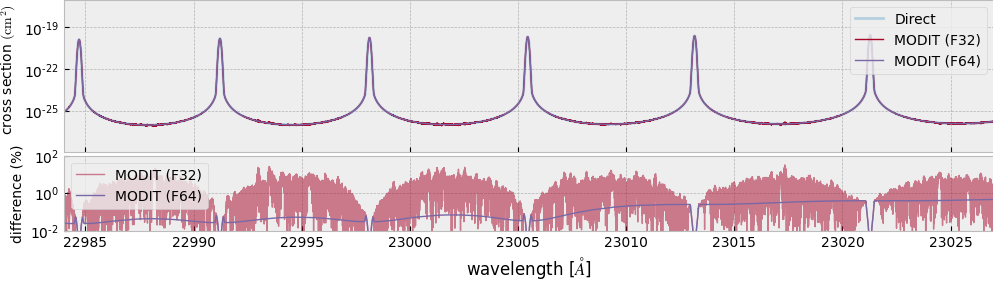

F32 and F64
=============================

ExoJAX uses mixture of F32 and F64, depending on functions.
See `#Issue 106 <https://github.com/HajimeKawahara/exojax/issues/106>`_ for various comparison of F32 and F64.

Resolution of wavenumber 
--------------------------------

F32 (single precision floating point number) is acceptable for most functions in ExoJAX. The exception is the wavenumber. For instace, let's assume nu=2000.0396123 cm-1 and the line center hatnu=2000.0396122 cm-1. If applying F32, we get np.float32(2000.0396123)-np.float32(2000.0396122) = 0.0. The truncation errors as observed here result in a slight shift of the molecular lines. To avoid the line shift due to the truncation errors, we should use the numpy version (F64) for the initialization of the wavenumber for LPF/MODIT/DIT when using `initspec <../exojax/exojax.spec.html#module-exojax.spec.initspec>`_.

- `make_numatrix0 <../exojax/exojax.spec.html#exojax.spec.make_numatrix.make_numatrix0>`_ assumes Numpy F64 input. 
- See :doc:`../tutorials/opacity` for an example of the F32/F64 issue in LPF.
- One of the reasons why MODIT needs to precompute the wavenumber grid of LSD is also related to this issue.

.. warning::
   
   In short, all of the input wavenumber and grids in `initspec <../exojax/exojax.spec.html#module-exojax.spec.initspec>`_ should be F64 numpy array to avoid the line shift due to the truncation errors.

JAX with F64
-------------------

The default precision of JAX is F32 although one can use JAX in F64 but without XLA.
One can switch to F64 by using config.update in jax:

.. code:: ipython
       
       >>> from jax.config import config                                                  
       >>> config.update("jax_enable_x64", True)
	  

High-dynamic range opacity using MODIT
------------------------------------------

Becuase MODIT uses FFT in its algorithm, MODIT w/ F32 has larger error when computing high-dynamic range. The most severe error occurs at lower values of cross section, as shown this figure. The use of F64 siginificanlty improves these errors. 

