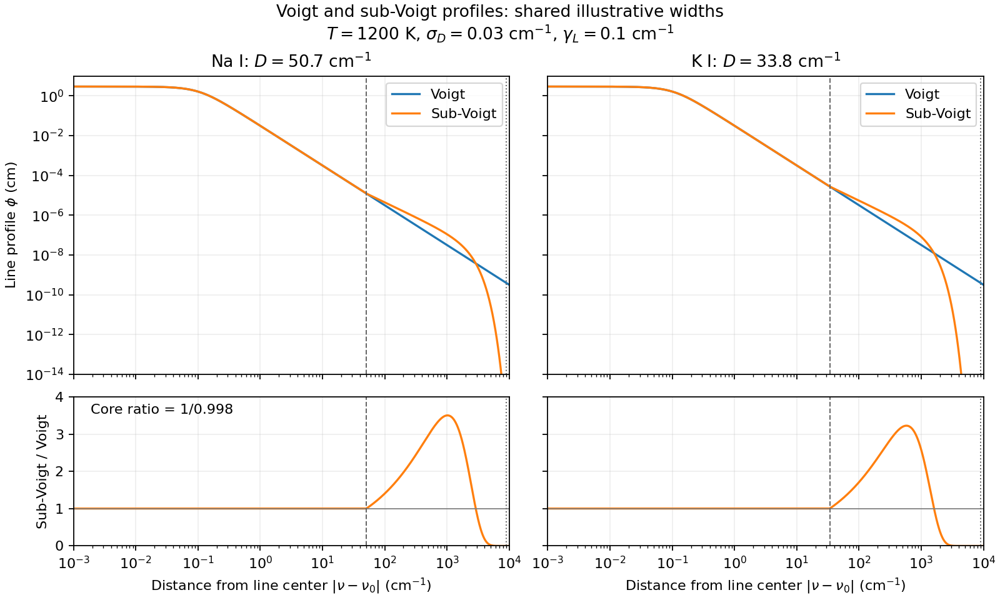

Kurucz atomic lines
==================

Load an existing Kurucz line list with ``AdbKurucz(path, nurange=nu_grid)``.
To let RADIS download and cache one atomic species, use the explicit
``from_radis`` constructor:

.. code-block:: python

    import numpy as np
    from exojax.database import AdbKurucz
    from exojax.opacity import OpaDirect

    nu_grid = np.linspace(19950.0, 20050.0, 2000)  # vacuum cm-1
    adb = AdbKurucz.from_radis(
        "Fe_I", nu_grid,
        local_databases=".database/radis-kurucz",
        margin=10.0,
        gpu_transfer=False,
    )
    # Select lines on the host before generating JAX line arrays if needed.
    adb.generate_jnp_arrays()
    opa = OpaDirect(adb, nu_grid)
    cross_section = opa.xsvector(3000.0, 0.1)  # K, bar; output in cm2
    print(adb.provenance)

``from_radis`` requires a finite positive wavenumber interval or grid. Its
``margin`` expands the fetch interval as well as the ExoJAX selection interval.
Supported species must have ExoJAX partition functions and atomic metadata;
examples are ``Fe_I`` and ``Fe_II``. Unsupported species are rejected before
downloading. Missing or nonfinite line parameters are reported as errors.

RADIS manages downloads, cache registration, and cache policies. ``cache`` is
passed to RADIS, and the default ``True`` reuses registered cache files when
available. The initial download covers the species line list; the requested
wavenumber interval filters the cached data loaded into ExoJAX.
``databank_name`` defaults to ``"ExoJAX-Kurucz-{molecule}"``; choose
a different name when maintaining a separate cache for the same species.
``engine="pytables"`` is the default, and ``"vaex"`` requires that optional
backend. ``adb.provenance`` records the species, RADIS version, and cache paths;
download URLs and dates remain in RADIS cache metadata.

Line positions and Einstein A coefficients come from RADIS. Its air/vacuum
conversion can produce small differences from the existing local-file reader.
ExoJAX continues to compute the reference line strengths, partition functions,
and broadening. ``Irwin=True`` selects the Irwin polynomial for Fe I consistently
at the reference and evaluation temperatures; other species retain the
Barklem and Collet partition functions. ``gpu_transfer=False`` delays line-array
transfer; partition-function calculations still use JAX.

Visible Na and K
---------------

``OpaAlkali`` applies sub-Voigt wings to every selected Na I or K I line,
as in the Clear-Base update of `Mullens et al. (2024), Section 2.4.3
<https://arxiv.org/html/2410.19253v1#S2.SS4.SSS3>`_. It accepts an
``AdbKurucz`` or ``AdbVald`` containing one neutral species:

.. code-block:: python

    from exojax.opacity import OpaAlkali

    nu_grid = np.linspace(10000.0, 50000.0, 20000)
    adb = AdbKurucz("gf1100.all", nurange=nu_grid, margin=9000.0)
    opa = OpaAlkali(adb, nu_grid)
    cross_section = opa.xsvector(1200.0, 0.1)  # cm2 per Na atom
    # Use gf1900.all for K I, and apply each species' abundance separately.

Include line centers up to 9000 cm-1 outside the evaluation grid. For large
grids, evaluate wavelength chunks to limit direct line-by-line memory use.
Temperatures are in K and total pressures are in bar; ``xsmatrix(Tarr, Parr)``
returns an array of shape ``(Nlayer, Nwavenumber)``.

The profile follows the `Cthulhu implementation
<https://github.com/MartianColonist/Cthulhu/blob/f9c72089e3ed71335223cefa0641b1ff24760008/Cthulhu/Voigt.py>`_
of `Baudino et al. (2015), Equation 1 <https://arxiv.org/abs/1504.04876>`_.
For distance ``d`` from line center and ``D = a * (T/500)**0.6``, it uses
the Voigt core for ``d < D`` and
``V(D) * (D/d)**1.5 * exp(-hcperk*d**2/(T*b))`` outside.
The constants ``(a, b)`` are ``(30, 5000)`` for Na and ``(20, 1600)`` for K,
in cm-1. Cthulhu's K detuning differs from the value 50 in the original
Baudino paper. The whole profile is divided by 0.998 and set to zero beyond
9000 cm-1. This preserves the source's small discontinuity at ``D`` and fixed
normalization; it does not enforce unit area or smooth the join.

Line strengths, partition functions, and default Lorentz widths retain
``OpaDirect``'s VALD/Kurucz treatment, including ``vmr_fraction`` in H, He, H2
order. The optional ``atomic_broadening(T, P)`` callback replaces the total
Lorentz HWHM exactly as in ``OpaDirect``. The symmetric wing fit and its
extension to all lines are approximations; matching this prescription does
not reproduce POSEIDON's line list or pressure widths. JAX temperature and
pressure derivatives are supported away from the profile joins.

    Single-line shapes at 1200 K with the same illustrative Doppler and Lorentz
    widths for both species; no line strengths or abundances are applied.
    Dashed lines mark the core/wing joins and dotted lines the 9000 cm-1 cutoff.
    The intermediate wings can exceed Voigt before exponential suppression
    dominates. The core ratio is 1/0.998, and zero profiles are omitted only
    from the logarithmic upper panels.

Regenerate the figure with ``python examples/plot_alkali_profiles.py`` from
the repository root. The essential profile comparison is:

.. code-block:: python

    import numpy as np
    import matplotlib.pyplot as plt
    from exojax.opacity.lpf.lpf import voigt
    from exojax.opacity.alkali import subvoigt

    d = np.geomspace(1e-3, 1e4, 2000)  # cm-1 from line center
    T, sigmaD, gammaL = 1200.0, 0.03, 0.1  # K, cm-1, cm-1
    plt.loglog(d, voigt(d, sigmaD, gammaL), label="Voigt")
    for name, a, b in (("Na", 30.0, 5000.0), ("K", 20.0, 1600.0)):
        plt.loglog(d, subvoigt(d, sigmaD, gammaL, T, a, b), label=name)
    plt.legend()
    plt.show()
