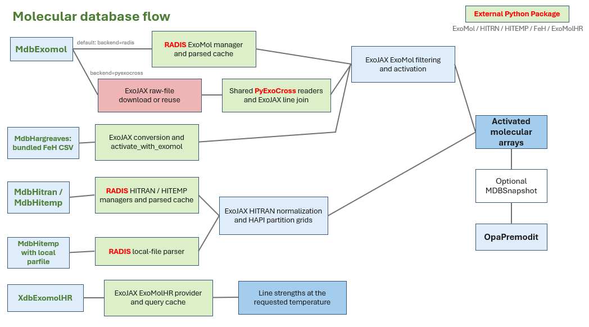
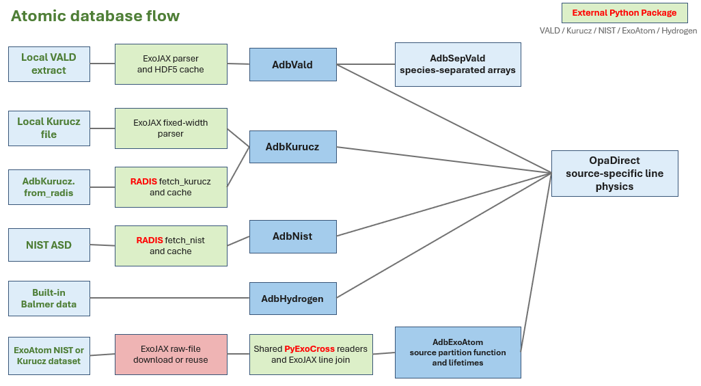

Molecular and Atomic Databases (``mdb`` / ``adb``)
====================================================

Database objects supply line data to opacity calculators. Import the classes
below from ``exojax.database``; follow the database links for usage examples.

Molecular databases
-------------------

.. list-table::
   :header-rows: 1
   :widths: 20 25 55

   * - Database
     - Class
     - Loading path
   * - :doc:`ExoMol <exomol>`
     - ``MdbExomol``
     - RADIS download/cache by default; optional PyExoCross reader.
   * - :doc:`HITRAN <api>`
     - ``MdbHitran``
     - RADIS download/cache.
   * - :doc:`HITEMP <api>`
     - ``MdbHitemp``
     - RADIS download/cache, or a local file with ``parfile=...``.
   * - :doc:`FeH (Hargreaves) <customapi>`
     - ``MdbHargreaves``
     - Bundled CSV; converted and activated with an ExoMol object.
   * - :doc:`ExoMolHR <../tutorials/exomolhr>`
     - ``XdbExomolHR``
     - ExoJAX download/cache; line strengths at one requested temperature.

Select ``MdbExomol(..., backend="pyexocross")`` after installing the
:doc:`optional dependency <exomol>`. Leave ``engine=None`` for this backend;
``engine`` selects the storage/DataFrame implementation where supported.
:doc:`MultiMol <../tutorials/multimol>` combines molecular databases and
currently uses the RADIS default for ExoMol.

   Molecular loading paths, with an example route to ``OpaPremodit``.

Atomic databases
----------------

.. list-table::
   :header-rows: 1
   :widths: 20 25 55

   * - Database
     - Class
     - Loading path
   * - :doc:`VALD3 <atomll>`
     - ``AdbVald``
     - Manually requested extract; ExoJAX reader and local HDF5 cache.
   * - :doc:`Kurucz <kurucz>`
     - ``AdbKurucz``
     - ExoJAX local-file reader, or RADIS download/cache via ``from_radis()``.
   * - :doc:`NIST ASD <nist>`
     - ``AdbNist``
     - RADIS download/cache.
   * - :doc:`ExoAtom <exoatom>`
     - ``AdbExoAtom``
     - ExoJAX raw-file download/reuse and PyExoCross reader; source partition function.
   * - Hydrogen Balmer lines
     - ``AdbHydrogen``
     - Built-in line data for upper levels 3--10; no download.

ExoAtom's NIST/Kurucz datasets use a separate loading path from
``AdbNist``/``AdbKurucz``. For ``OpaDirect``, NIST requires an explicit
``atomic_broadening(T, P)`` callback. ExoAtom defaults to natural widths when
available and otherwise requires this callback; it supplies no default
pressure broadening. See :doc:`nist` and :doc:`exoatom` for examples.
``AdbSepVald`` groups an existing VALD database by species.

   Atomic loading paths and their connection to ``OpaDirect``.

Diagrams from `issue #807 <https://github.com/HajimeKawahara/exojax/issues/807>`_.
