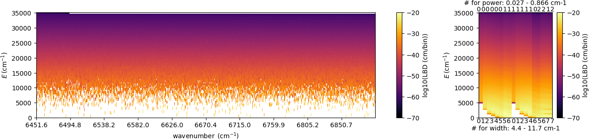
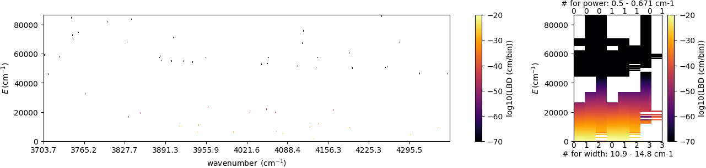

PreMODIT
=================

`Last update: Jan 8th (2025) Hajime Kawahara`

**PreMODIT (Precomputation of Line Density + MODIT)** is an enhanced algorithm building upon the foundations of MODIT. 
A key limitation of :doc:`modit` is its requirement to recalculate the lineshape density (LSD) from the complete transition 
information whenever the temperature or pressure conditions change. 
This approach necessitates storing all transition data in device memory, leading to inefficiencies in memory usage.

**PreMODIT** addresses this limitation by introducing a preprocessing step to compress line information prior to storage in device memory. 
This compression significantly reduces memory requirements. 

PreMODIT precomputes a density field, referred to as the Line Base Density (LBD), which contains line information. 
When temperature and pressure are provided, the LBD is converted into LSD, enabling the calculation of opacity using the same method as MODIT. 
As a result, there is no need to use the molecular database (mdb) for LSD calculations each time.
However, a trade-off is that the algorithm's accuracy is constrained to a predefined temperature range. 
To accommodate this limitation, the ``auto_trange`` option is provided in `OpaPremodit <../exojax/exojax.spec.html#exojax.spec.opacalc.OpaPremodit>`_. 

The functionality of ``auto_trange`` depends on the version of the default elower grid temperature range (degt) file. 
For more details, refer to :doc:`premodit_trange`. Users can specify the degt file version through the ``version_auto_trange`` option.
Details of the PreMODIT algorithm will be described in `Paper II <https://arxiv.org/abs/2410.06900>`_.

.. code:: ipython
	
    from exojax.opacity.opacalc import OpaPremodit
    from jax import config
    config.update("jax_enable_x64", True)
    diffmode = 0
    opa = OpaPremodit(mdb=mdbCO,
                      nu_grid=nus,
                      diffmode=diffmode,
                      auto_trange=[400.0, 1500.0])

This ensures an accuracy of 1% within the temperature range of 400–1500 K.  
It is important to note that enabling `config.update("jax_enable_x64")` configures JAX to utilize 64-bit precision; 
refer to the next section for details. Alternatively, 32-bit precision can also be used, as explained below.  

For users who are well-acquainted with the PreMODIT algorithm, parameters can be specified directly using the ``manual_params`` option.

.. code:: ipython
	
    dE = 300.0 # cm-1
    Tref = 400.0 # in Kelvin
    Twt = 1000.0 # in Kelvin
    opa = OpaPremodit(mdb=mdbCO,
                      nu_grid=nus,
                      diffmode=diffmode,
                      manual_params=[dE, Tref, Twt])

Visulization of the Line Base Density
^^^^^^^^^^^^^^^^^^^^^^^^^^^^^^^^^^^^^^^^^^^

The visualization of the LBD is shown below. For water, the LBD appears densely populated, whereas for CO, it is noticeably sparse.

.. code:: ipython

    from exojax.utils.grids import wavenumber_grid
    from exojax.database.api  import MdbExomol
    from exojax.plot.opaplot import plot_lbd

    nu_grid, wav, resolution = wavenumber_grid(
        14500.0, 15500.0, 100000, unit="AA", xsmode="premodit"
    )
    mdb = MdbExomol(".database/H2O/1H2-16O/POKAZATEL/", nurange=nu_grid)
    opa = OpaPremodit(mdb, nu_grid, auto_trange=[500.0, 1000.0], dit_grid_resolution=0.2)
    lbd, midx, gegrid, gngamma, gn, R, pm = opa.opainfo
    plot_lbd(lbd, gegrid, gngamma, gn, midx, nu_grid)

.. code:: ipython

    nu_grid, wav, resolution = wavenumber_grid(
        22900.0, 27000.0, 200000, unit="AA", xsmode="premodit"
    )
    mdb = MdbExomol(".database/CO/12C-16O/Li2015/", nurange=nu_grid)
    opa = OpaPremodit(mdb, nu_grid, auto_trange=[500.0, 1000.0], dit_grid_resolution=0.2)
    lbd, midx, gegrid, gngamma, gn, R, pm = opa.opainfo
    plot_lbd(lbd, gegrid, gngamma, gn, midx, nu_grid)

On 32bit and 64bit mode
^^^^^^^^^^^^^^^^^^^^^^^^^^^^^^^^^^^^^

We recommend using JAX's 64-bit mode unless you are confident that 32-bit precision is sufficient for your specific application. 
While 64-bit mode requires more device memory and computational time, it provides greater numerical stability. 
If you plan to perform real retrievals, ensure that using 32-bit precision does not significantly impact the results. 
For initial analyses or cases where precision is critical, 64-bit mode is the safer option.

.. code:: ipython
	
    from jax import config
    config.update("jax_enable_x64", True)

But, if you wanna try to use 32bit mode, use ``allow_32bit`` option.

.. code:: ipython

	from jax import config
    config.update("jax_enable_x64", False)
    opa = OpaPremodit(mdb=mdbCO,
                      nu_grid=nus,
                      diffmode=diffmode,
                      auto_trange=[400.0, 1500.0]
                      allow_32bit=True)    

Otherwise, you will see ValueError:

.. code:: ipython

	from jax import config
    config.update("jax_enable_x64", False)
    opa = OpaPremodit(mdb=mdbCO,
                      nu_grid=nus,
                      diffmode=diffmode,
                      auto_trange=[400.0, 1500.0])    
    # -> JAX 32bit mode is not allowed. Use allow_32bit = True or ... 

Changing the Resolution of the Broadening Parameters 
^^^^^^^^^^^^^^^^^^^^^^^^^^^^^^^^^^^^^^^^^^^^^^^^^^^^^^^

By setting ``broadening_resolution`` option to ``{"mode": "manual", "value": 1.0}``, 
``OpaPremodit`` controls the resolution of the broadening parameters.
The default value of `{"mode": "manual", "value": 0.2}` might be overkilled for real exoplanet/brown dwarf spectrum analysis.

.. code:: ipython
	
    opa = OpaPremodit(mdb=mdb,
                      nu_grid=nu_grid,
                      diffmode=diffmode,
                      auto_trange=[500.0, 1500.0],
                      broadening_resolution={"mode": "manual", "value": 1.0})
    
You can check the grid overlaied on the data distribution by

.. code:: ipython
	
    opa.plot_broadening_parameters()

.. image:: premodit_files/example_manual.png

Note that ``gamma`` in the above Figure is that at T = ``opa.Tref_broadening``. 

``broadening_resolution = {"mode": "minmax", "value": None}`` using min/max values of the broadening parameters as grids

.. image:: premodit_files/example_minmax.png

Single Broadening Parameter Set
^^^^^^^^^^^^^^^^^^^^^^^^^^^^^^^^^^^^

By default, ``OpaPremodit`` constructs a grid for the broadening parameter. 
However, reducing the number of broadening grids can be advantageous for fitting purposes, as it decreases device memory usage. 
The memory usage scales with the product of the number of broadening grids, free parameters, atmospheric layers, wavenumber grid points, 
and the byte size of F64 or F32 precision.  

To use a single broadening parameter, set the ``broadening_resolution`` option to ``{"mode": "single", "value": None}``. 
When ``"value"`` is set to ``None``, the median values of ``gamma_ref`` (the width in cm-1 at the reference pressure) 
and ``n_Texp`` (the temperature exponent) at 296 K are used.  

In single broadening parameter mode, the reference temperature for broadening (``Tref_broadening``) remains fixed at 296 K. 
To specify custom values, provide ``gamma_ref`` and ``n_Texp`` at 296 K as a list in the format ``[gamma_ref, n_Texp]`` for the ``"value"`` field.

.. code:: ipython
	
    opa = OpaPremodit(mdb=mdb,
                      nu_grid=nu_grid,
                      diffmode=diffmode,
                      auto_trange=[500.0, 1500.0],
                      broadening_resolution={"mode": "single", "value": None})
    

In the above case, we assumed the median of broadening parameters of mdb. 
If you want to give the specific values use "single_broadening_parameters" option.

.. image:: premodit_files/example_single.png

