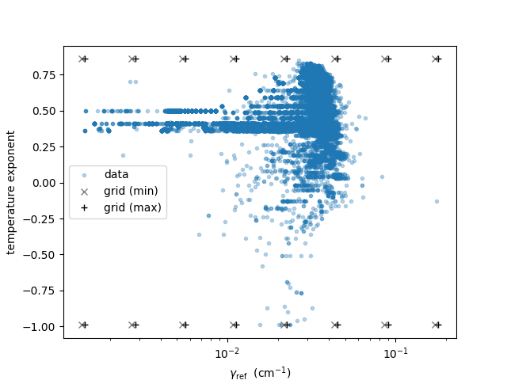
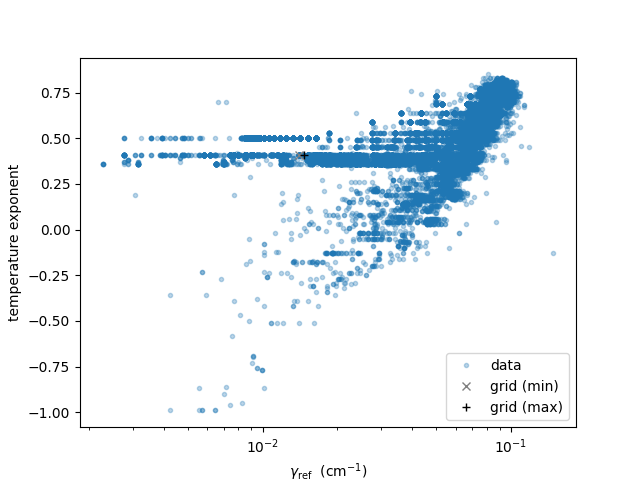

PreMODIT
=================

`Last update: Nov 26th (2023) Hajime Kawahara`

PreMODIT (Precomputation of line density + MODIT) is the successor algorithm to MODIT. 
The problem with :doc:`modit` is that the lineshape density (LSD) has to be recalculated 
from all transition information each time the temperature or pressure conditions are changed. 
This means that all transition information must be stored in device memory, 
which is not memory efficient.

`PreMODIT` is an algorithm that solves the above problem.
Details of the algorithm will be described in a forthcoming paper (Kawahara, Kawashima et al. in prep).
But, the basic idea is to compress the line information before storing it in device memory.
While this change saves device memory, the drawback is that the temperature range over which accuracy can be 
guaranteed must be set in advance. 
Therefore, we need the `auto_trange` option in `OpaPremodit <../exojax/exojax.spec.html#exojax.spec.opacalc.OpaPremodit>`_.

.. code:: ipython
	
    from exojax.spec.opacalc import OpaPremodit
    from jax import config
    config.update("jax_enable_x64", True)
    diffmode = 0
    opa = OpaPremodit(mdb=mdbCO,
                      nu_grid=nus,
                      diffmode=diffmode,
                      auto_trange=[400.0, 1500.0])

This means that 1% accuracy is guaranteed between 400 - 1500 K. 
Note that `config.update("jax_enable_x64")` enforces JAX to use 64 bit; see the next section.
If you are more familiar with PreMODIT's algorithm, you can specify the parameters directly using the `manual_params` option.

.. code:: ipython
	
    dE = 300.0 # cm-1
    Tref = 400.0 # in Kelvin
    Twt = 1000.0 # in Kelvin
    opa = OpaPremodit(mdb=mdbCO,
                      nu_grid=nus,
                      diffmode=diffmode,
                      manual_params=[dE, Tref, Twt])

On 32bit and 64bit mode
^^^^^^^^^^^^^^^^^^^^^^^^^^^^^^^^^^^^^

We strongly recommend to use JAX 64bit mode unless you are confident that 32bit is enough for your case. 
Because the 64 bit mode uses more device memory and computational time, 
if you perform real retrieval, confirm that the 32 bit does not any severe impact on the results.
But, for the first case, the 64 bit is the safe option.

.. code:: ipython
	
    from jax import config
    config.update("jax_enable_x64", True)

But, if you wanna try to use 32bit mode, use `allow_32bit` option.

.. code:: ipython

	from jax import config
    config.update("jax_enable_x64", False)
    opa = OpaPremodit(mdb=mdbCO,
                      nu_grid=nus,
                      diffmode=diffmode,
                      auto_trange=[400.0, 1500.0]
                      allow_32bit=True)    

Otherwise, you will see ValueError:

.. code:: ipython

	from jax import config
    config.update("jax_enable_x64", False)
    opa = OpaPremodit(mdb=mdbCO,
                      nu_grid=nus,
                      diffmode=diffmode,
                      auto_trange=[400.0, 1500.0])    
    # -> JAX 32bit mode is not allowed. Use allow_32bit = True or ... 

Changing the Resolution of the Broadening Parameters 
^^^^^^^^^^^^^^^^^^^^^^^^^^^^^^^^^^^^^^^^^^^^^^^^^^^^^^^

By setting `broadening_resolution` option to `{"mode": "manual", "value": 1.0}`, 
`OpaPremodit` controls the resolution of the broadening parameters.
The default value of `{"mode": "manual", "value": 0.2}` might be overkilled for real exoplanet/brown dwarf spectrum analysis.

.. code:: ipython
	
    opa = OpaPremodit(mdb=mdb,
                      nu_grid=nu_grid,
                      diffmode=diffmode,
                      auto_trange=[500.0, 1500.0],
                      broadening_resolution={"mode": "manual", "value": 1.0})
    
You can check the grid overlaied on the data distribution by

.. code:: ipython
	
    opa.plot_broadening_parameters()

Note that `gamma` in the above Figure is that at T = `opa.Tref_broadening`. 

`broadening_resolution = {"mode": "minmax", "value": None}` using min/max values of the broadening parameters as grids

Single Broadening Parameter Set
^^^^^^^^^^^^^^^^^^^^^^^^^^^^^^^^^^^^

By default, `OpaPremodit` constructs one grid for the broadening parameter. 
However, reducing the number of broadening grids may be useful for fitting, 
since the device memory usage becomes 
broadening grid number x free parameter number x atmospheric layer number x wavenumber grid number x F64/F32 byte number. 
By setting `broadening_resolution` option to `{"mode": "single", "value": None}`, PreMODIT can be used with a single broadening parameter.
When adopting None to `"value"`, the median values of `gamma_ref` (width cm-1 at reference) and `n_Texp` (temperature exponent) at 296K are used. 
For the single broadening parameter mode, we do not change `Tref_broadening` from 296K.
So, if you wanna change the values, input,  `gamma_ref` and `n_Texp` at 296K into `"value"` as a list `[gamma_ref, n_Texp]` .

.. code:: ipython
	
    opa = OpaPremodit(mdb=mdb,
                      nu_grid=nu_grid,
                      diffmode=diffmode,
                      auto_trange=[500.0, 1500.0],
                      broadening_resolution={"mode": "single", "value": None})
    

In the above case, we assumed the median of broadening parameters of mdb. 
If you want to give the specific values use "single_broadening_parameters" option.

