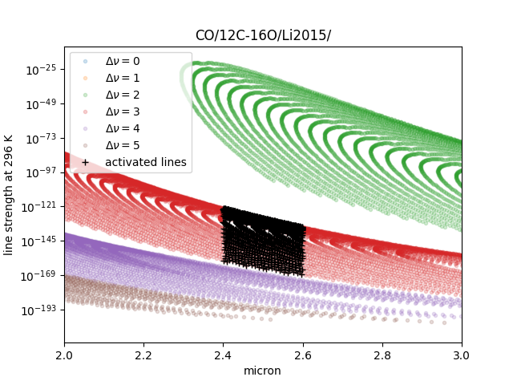

Filtering by Quantum States (ExoMol)
=====================================

When we would like to filter the lines based on quantum states, such as vibration states (v), we can mask the lines by manual. In this case, we postpone the activation of mdb and use DataFrame for masking. Here is the example for the initialization. 

.. code:: ipython
	
    >>> from exojax.utils.grids import wavenumber_grid
    >>> from exojax.spec import api
	
    >>> nus, wav, res = wavenumber_grid(24000.0, 26000.0, 1000, unit="AA")
	>>> mdb = api.MdbExomol(""CO/12C-16O/Li2015/"", nus, optional_quantum_states=True, activation=False)

Then, let's check DataFrame. 

.. code:: ipython
	
    >>> print(mdb.df)

You find these fields are available for Li2015:

- i_upper    i_lower    A          nu_lines      gup    jlower    jupper    elower      v_l    v_u    kp_l    kp_u    Sij0

We would use the lines with the condition delta nu = 3. 

.. code:: ipython
	
    >>> mask = (mdb.df["v_u"] - mdb.df["v_l"] == 3) 

Then, "activate" the mdb, i.e. making instances (such as mdb.nu_lines ... ), computing broadening parameters etc. 

.. code:: ipython
	
    >>> mdb.activate(mdb.df, mask)

