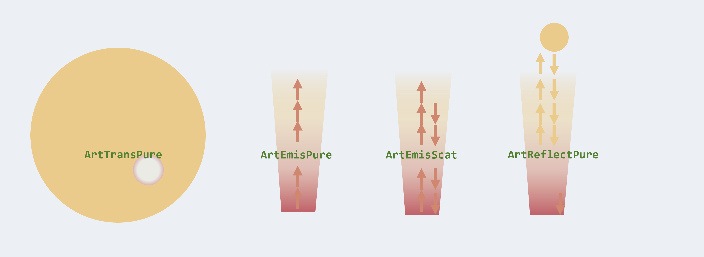

Radiative Transfer in ExoJAX
====================================

Radiative Transfer Schemes in ExoJAX
^^^^^^^^^^^^^^^^^^^^^^^^^^^^^^^^^^^^^^^^^^^^

Figure. ExoJAX supports the radiative transfer functionalities of the emission (pure absorption, incl. scattering), reflection, and transmission spectra.

ExoJAX uses a layer-based atmospheric model for `radiative transfer <https://en.wikipedia.org/wiki/Radiative_transfer>`_ (RT). 
In ExoJAX, one can utilize spectral models for emission, reflection, and transmission. This necessitates solving for radiative transfer. 
There are various methods to solve radiative transfer, and the following describes those available in ExoJAX.

Regarding emission in ExoJAX, there are two types: without scattering and with scattering. 
The non-scattering type assumes **pure absorption**, for which there are two methods: 
one that transfers intensity (**ibased**) and another that transfers flux (**fbased**).
``ibased`` is regarded as the default method for pure absorption. 
See :doc:`../userguide/rtransfer_ibased_pure` for the details of the `ibased` method for emission with pure absorption.
``fbased`` is an optional for pure absorption. But see :doc:`../userguide/rtransfer_fbased_pure`. 

For emission with scattering in ExoJAX, there are implementations for treating the scattering component as an effective reflectivity 
using **the flux-adding treatment** (`Robinson and Crisp 2018 <https://www.sciencedirect.com/science/article/pii/S0022407317305101?via%3Dihub>`_), 
and as an effective transmission using the **LART** method.
These are the fbased computation.
Regarding reflected light in ExoJAX, the flux-adding treatment can be utilized.

See :doc:`../userguide/rtransfer_fbased` for the details of the `fbased` method for reflection and/or emission with scattering.

All of the ``fbased`` schemes are currently based on the two-stream approximation, althogh the ``ibased`` schemes can specify the number of the streams. 
In the future, other ibased schemes for scattering/reflection is planned, but as of January 2025, it has not yet been implemented.

For transmission spectroscopy in ExoJAX, the options are primarily limited to differences in the integration methods. 
Both the Trapezoid integration method and the method using Simpson's rule are available.
See :doc:`../userguide/rtransfer_transmission` for the details of the transmission method.

Lastly, although it may not be widely used, there is a radiative transfer method called ``ArtAbsPure``, which accounts only for atmospheric absorption
(though surface reflection can be included). 
This can be utilized for calculating transmitted light through Earth's atmosphere or reflected light in cases without atmospheric scattering.

Atmospheric Radiative Transfer (art) class
^^^^^^^^^^^^^^^^^^^^^^^^^^^^^^^^^^^^^^^^^^^^^^^^

ExoJAX's code is primarily written in a function-based manner, allowing for the execution of each process of radiative transfer individually. 
However, for those who are not interested in the details, the ``art`` class can be utilized as an interface for radiative transfer.
Some methods also provide ``opart``-style classes that enable layer-wise computation, reducing device memory usage.

+------------------+---------------------+------------------------+------------------------+
|spectrum type     |including...         |``art`` in atmrt.py     | ``opart`` in opart.py  |
+------------------+---------------------+------------------------+------------------------+
|Emission          | no scattering       |``ArtEmisPure``         |``OpartEmisPure``       |
+------------------+---------------------+------------------------+------------------------+
|Emission          | w/ scattering       |``ArtEmisScat``         |``OpartEmisScat``       |
+------------------+---------------------+------------------------+------------------------+
|Reflection        | no emission         |``ArtReflectPure``      |``OpartReflectPure``    |
+------------------+---------------------+------------------------+------------------------+
|Reflection        | w/ emission         |``ArtReflectEmis``      |``OpartReflectEmis``    |
+------------------+---------------------+------------------------+------------------------+
|Transmission      |                     |``ArtTransPure``        | N/A                    |
+------------------+---------------------+------------------------+------------------------+
|Absorption only   | surface reflection  |``ArtAbsPure``          | N/A                    |
+------------------+---------------------+------------------------+------------------------+

See the following APIs for the details of these art classes:

- `exojax.spec.atmrt.ArtEmisPure <../exojax/exojax.spec.html#exojax.spec.atmrt.ArtEmisPure>`_
- `exojax.spec.atmrt.ArtEmisScat <../exojax/exojax.spec.html#exojax.spec.atmrt.ArtEmisScat>`_
- `exojax.spec.atmrt.ArtReflectPure <../exojax/exojax.spec.html#exojax.spec.atmrt.ArtReflectPure>`_
- `exojax.spec.atmrt.ArtReflectEmis <../exojax/exojax.spec.html#exojax.spec.atmrt.ArtReflectEmis>`_
- `exojax.spec.atmrt.ArtTransPure <../exojax/exojax.spec.html#exojax.spec.atmrt.ArtTransPure>`_
- `exojax.spec.atmrt.ArtAbsPure <../exojax/exojax.spec.html#exojax.spec.atmrt.ArtAbsPure>`_

