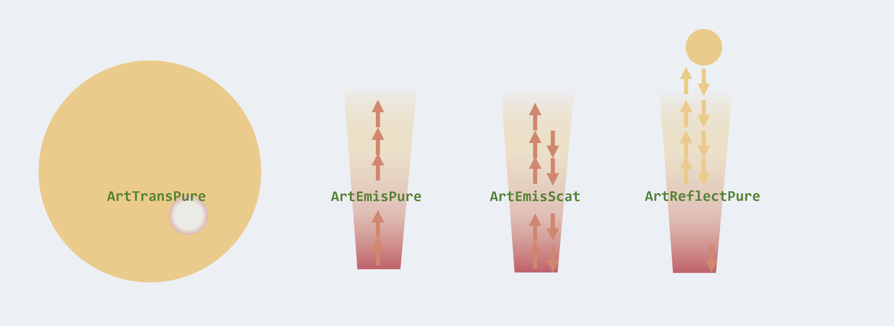

Radiative Transfer in ExoJAX
====================================

Radiative Transfer Schemes in ExoJAX
^^^^^^^^^^^^^^^^^^^^^^^^^^^^^^^^^^^^^^^^^^^^

Figure. ExoJAX supports the radiative transfer functionalities of the emission (pure absorption, incl. scattering), reflection, and transmission spectra.

ExoJAX uses a layer-based atmospheric model for `radiative transfer <https://en.wikipedia.org/wiki/Radiative_transfer>`_ (RT). 
In ExoJAX, one can utilize spectral models for emission, reflection, and transmission. This necessitates solving for radiative transfer. 
There are various methods to solve radiative transfer, and the following describes those available in ExoJAX.

Regarding emission in ExoJAX, there are two types: without scattering and with scattering. 
The non-scattering type assumes **pure absorption**, for which there are two methods: 
one that transfers intensity (**ibased**) and another that transfers flux (**fbased**).
``ibased`` is regarded as the default method for pure absorption. 
See :doc:`../userguide/rtransfer_ibased_pure` for the details of the `ibased` method for emission with pure absorption.
``fbased`` is an optional for pure absorption. But see :doc:`../userguide/rtransfer_fbased_pure`. 

For emission with scattering in ExoJAX, there are implementations for treating the scattering component as an effective reflectivity 
using **the flux-adding treatment** (`Robinson and Crisp 2018 <https://www.sciencedirect.com/science/article/pii/S0022407317305101?via%3Dihub>`_), 
and as an effective transmission using the **LART** method.
These are flux-based computations.
``ArtEmisScat`` also supports SFM-2st, where SFM stands for the source function method
(Toon et al. 1989), with Toon hemispheric-mean two-stream fluxes
(``rtsolver="sfm2st_toon_hemispheric_mean"``). This scheme first computes the two-stream fluxes,
then evaluates the emission spectrum by the intensity-based formal solution.
For reflected light, ``ArtReflectPure`` and ``ArtReflectEmis`` support both the
flux-adding treatment and SFM-2st. The latter treats ``incoming_flux`` as a
diffuse hemispheric flux at the top boundary.

``ArtReflectPure.run_direct`` computes the reflected specific intensity for
a direct stellar beam using SFM and Toon quadrature. Specify positive cosines
of the incident and outgoing zenith angles, and their relative azimuth:

.. code-block:: python

    intensity = art.run_direct(
        dtau, single_scattering_albedo,
        reflectivity_surface, incoming_flux,
        mu_in=0.6, mu_out=0.6,
        relative_azimuth=0.0, phase_function="rayleigh",
    )

Here ``incoming_flux`` is irradiance normal to the beam; the local horizontal
incident flux is ``mu_in * incoming_flux``. The result is specific intensity
in the incident irradiance units per steradian. The relative azimuth is the
angle in radians between the outward star and observer directions; full phase
has equal direction cosines and zero relative azimuth. Use ``jax.vmap`` to
evaluate multiple direction pairs. This method always uses direct SFM,
independently of the diffuse ``rtsolver`` setting.

The supported phase functions are ``"rayleigh"`` and ``"isotropic"``. Single
scattering is integrated analytically in each homogeneous layer. Multiple
scattering uses a Toon-style hemispheric source reconstructed from quadrature
fluxes, averaged across each layer. Refine layers to check this approximation;
Rayleigh's higher angular moments, polarization, and cloud phase functions are
not included. Angular integration of this intensity does not exactly preserve
the two-stream energy balance, even after layer convergence. For example,
an isotropically scattering, conservative atmosphere of total optical depth 10 above a perfectly
reflecting surface has about 1--5% flux errors for incident cosines 0.1--1.
Direction-cosine derivatives at exactly normal incidence or emergence are
not guaranteed because the angular coordinates are singular there.
The lower boundary is Lambertian. For a transparent atmosphere,
``intensity = reflectivity_surface * mu_in * incoming_flux / pi``.
Disk integration to obtain geometric albedo is a separate step.
See `Toon et al. (1989) <https://doi.org/10.1029/JD094iD13p16287>`_
for the two-stream and source-function methods.

See :doc:`../userguide/rtransfer_fbased` for the details of the `fbased` method for reflection and/or emission with scattering.

All of the ``fbased`` schemes are currently based on the two-stream approximation, although the ``ibased`` schemes can specify the number of the streams.
The SFM-2st emission and reflection solvers use a two-stream source function
and an intensity-based angular integration with a configurable number of
streams.

For transmission spectroscopy in ExoJAX, the options are primarily limited to differences in the integration methods. 
Both the Trapezoid integration method and the method using Simpson's rule are available.
See :doc:`../userguide/rtransfer_transmission` for the details of the transmission method.

Lastly, although it may not be widely used, there is a radiative transfer method called ``ArtAbsPure``, which accounts only for atmospheric absorption
(though surface reflection can be included). 
This can be utilized for calculating transmitted light through Earth's atmosphere or reflected light in cases without atmospheric scattering.

Atmospheric Radiative Transfer (art) class
^^^^^^^^^^^^^^^^^^^^^^^^^^^^^^^^^^^^^^^^^^^^^^^^

ExoJAX's code is primarily written in a function-based manner, allowing for the execution of each process of radiative transfer individually. 
However, for those who are not interested in the details, the ``art`` class can be utilized as an interface for radiative transfer.
Some methods also provide ``opart``-style classes that enable layer-wise computation, reducing device memory usage.

+------------------+---------------------+------------------------+------------------------+
|spectrum type     |including...         |``art`` in atmrt.py     | ``opart`` in opart.py  |
+------------------+---------------------+------------------------+------------------------+
|Emission          | no scattering       |``ArtEmisPure``         |``OpartEmisPure``       |
+------------------+---------------------+------------------------+------------------------+
|Emission          | w/ scattering       |``ArtEmisScat``         |``OpartEmisScat``       |
+------------------+---------------------+------------------------+------------------------+
|Reflection        | no emission         |``ArtReflectPure``      |``OpartReflectPure``    |
+------------------+---------------------+------------------------+------------------------+
|Reflection        | w/ emission         |``ArtReflectEmis``      |``OpartReflectEmis``    |
+------------------+---------------------+------------------------+------------------------+
|Transmission      |                     |``ArtTransPure``        | N/A                    |
+------------------+---------------------+------------------------+------------------------+
|Absorption only   | surface reflection  |``ArtAbsPure``          | N/A                    |
+------------------+---------------------+------------------------+------------------------+

See the following APIs for the details of these art classes:

- `exojax.spec.atmrt.ArtEmisPure <../exojax/exojax.spec.html#exojax.spec.atmrt.ArtEmisPure>`_
- `exojax.spec.atmrt.ArtEmisScat <../exojax/exojax.spec.html#exojax.spec.atmrt.ArtEmisScat>`_
- `exojax.spec.atmrt.ArtReflectPure <../exojax/exojax.spec.html#exojax.spec.atmrt.ArtReflectPure>`_
- `exojax.spec.atmrt.ArtReflectEmis <../exojax/exojax.spec.html#exojax.spec.atmrt.ArtReflectEmis>`_
- `exojax.spec.atmrt.ArtTransPure <../exojax/exojax.spec.html#exojax.spec.atmrt.ArtTransPure>`_
- `exojax.spec.atmrt.ArtAbsPure <../exojax/exojax.spec.html#exojax.spec.atmrt.ArtAbsPure>`_
