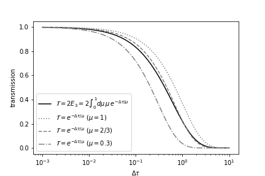

Flux-based Emission with pure absorption (optional)
------------------------------------------------------

.. warning::

    Currently, the flux-based ``EmisPure`` is optional. Unless there is a specific reason, the use of the intensity-based (``ibased``) method is recommended.
    See :doc:`../userguide/rtransfer_ibased_pure` for the intensity-based method.

Uses ``ArtPureEmis`` class
^^^^^^^^^^^^^^^^^^^^^^^^^^^^^^^^^^

The following is a typical example of code for calculating emission using fbased with the ``art`` class in ExoJAX. 
For pure absorption emission, ``ArtEmisPure`` is provided as the ``art`` class. 
To specify fbase, it is simply a matter of setting the option as ``rtsolver="fbased2st"`` when calling it (this is not default).

.. code:: ipython
    
    from exojax.rt import ArtEmisPure

    art = ArtEmisPure(pressure_top=1.e-8,
                      pressure_btm=1.e2,
                      nlayer=100,
                      nu_grid=nu_grid, 
                      rtsolver="fbased2st")
    
    art.change_temperature_range(400.0, 1500.0) #sets temperature range
    Tarr = art.powerlaw_temperature(1300.0, 0.1) # sets a powerlaw T-P profile
    mmr_arr = art.constant_mmr_profile(0.1) # sets a constant mass mixing ratio
    gravity = art.constant_gravity_profile(2478.57) #sets a constant gravity 

    # we here call OpaPremodit as opa just to compute xsmatrix 
    opa = OpaPremodit(mdb=mdb,
                      nu_grid=nu_grid,
                      diffmode=diffmode,
                      auto_trange=[art.Tlow, art.Thigh]) 
    xsmatrix = opa.xsmatrix(Tarr, art.pressure)

    dtau = art.opacity_profile_xs(xsmatrix, mmr_arr, opa.mdb.molmass, gravity) # computes optical depth profile  
    F0 = art.run(dtau, Tarr) # computes spectrum

Understands One-by-One
^^^^^^^^^^^^^^^^^^^^^^^^^^^^^^^^

The upward flux of the n-th layer (with pressure of :math:`P_n`) is connected to that of the (n-1)-th layer with transmission T and source function S. 

:math:`F_{n} = \mathcal{T}_n F_{n+1} + (1-\mathcal{T}_n) \, \mathcal{S}_n`

where :math:`P_{n-1} < P_n`. So, we need to specify a transmission and source function. 

- Source function

A black body emission as a source as,  

:math:`\mathcal{S} = \pi B(T)`

we can use `piBarr <../exojax/exojax.spec.html#exojax.spec.planck.piBarr>`_.

.. code:: ipython

    from exojax.rt import planck	  
	sourcef = planck.piBarr(Tarr,nus)

- Transmission for Pure Absorption: trans2E3

In this case, the transmission is given as

:math:`\mathcal{T}_n = 2 E_3(\Delta \tau_n ) = ( 1 - \Delta \tau_n) \exp{(- \Delta \tau_n)} + (\Delta \tau_n )^2 E_1(\Delta \tau_n )`

where :math:`\Delta \tau_n` is delta opacity in the n-th layer, :math:`E_j(x)` is the exopential integral of the :math:`j` -th order. In exojax, :math:`2 E_3(x)` is available as

.. code:: ipython
    
    from exojax.rt.rtransfer import trans2E3
    trans2E3(1.0) #-> DeviceArray(0.21938396, dtype=float32)

`trans2E3 <../exojax/exojax.spec.html#exojax.spec.rtransfer.trans2E3>`_ is auto-differentiable.
	
.. code:: ipython
        
    from jax import grad
    grad(trans2E3)(1.0) #-> DeviceArray(-0.29698896, dtype=float32)
    

Here is
:math:`\Delta \tau`
dependence of :math:`2 E_3(x)`:

	
`trans2E3 <../exojax/exojax.spec.html#exojax.spec.rtransfer.trans2E3>`_ is used in `rtrun <../exojax/exojax.spec.html#exojax.spec.rtransfer.rtrun>`_, which gives an emission spectral model with pure absorption. Then, `rtrun <../exojax/exojax.spec.html#exojax.spec.rtransfer.rtrun>`_ has two inputs, one is the arrays of :math:`\Delta \tau_n` and source funtion.

.. code:: python
    
    F0=rtrun(dtau,sourcef) 

Note that exojax uses a linear algebraic formulation to solve the RT. The detail description is provided in 
`Paper I <https://iopscience.iop.org/article/10.3847/1538-4365/ac3b4d>`_
.
