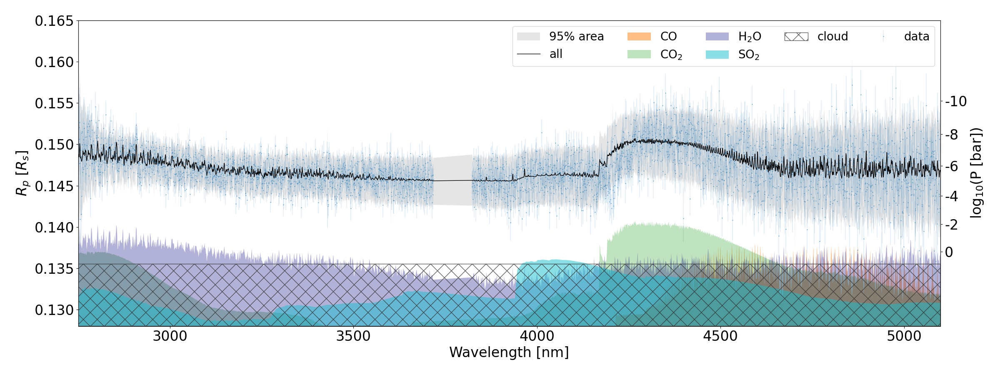

Transmission Spectroscopy
------------------------------

In transmission spectroscopy, the spectrum of the transit depth is measured. The transit depth is the square of the ratio between the planet's radius 
and the star's radius. Accordingly, ``ExoJAX`` calculates the square of the planet's radius.

:math:`R_{p,\nu}^2 =  R_{0}^2 + \Delta R_{p,\nu}^2`,

where 
:math:`R_0=\underline{r}_{N-1}`
is the lower boundary of the bottom layer. Atmosphere below this point must remain completely opaque.
The contribution of the atmospheric layers to the transit radius squared is expressed as

:math:`\Delta R_{p,\nu}^2 \equiv 2 \int_{R_{0}}^\infty [ 1 - \mathcal{T}_\nu(r)] r d r \approx 2 \int_{\underline{r}_{N-1}}^{\overline{r}_0} [ 1 - \mathcal{T}_\nu(r)] r d r`,

where 
:math:`\mathcal{T}_\nu(r) = e^{-t(r)}`
is the transmission at r and 
:math:`t(r)` 
is the chord optical depth at r and 
:math:`\underline{r}_0` is the lower boundary of the top of atmosphere. 

Uses ArtTransPure class
^^^^^^^^^^^^^^^^^^^^^^^^^^^^^^^^^^

To calculate the transmission spectrum in ExoJAX, the ``ArtTransPure`` class is convenient. 
For chord integration, one can choose either Simpson's method or the trapezoidal method from the integration options.
Here is the example of the computation of the transmission radius. We here use Simpson's rule for the chord integration. 

In transmission spectroscopy, assuming a constant gravity across the layers is often not a good approximation. 
The ``gravity_profile`` instance in the ``ArtTransPure`` class allows for easy calculation of the gravity profile, addressing this concern in ``ExoJAX``.

.. code:: ipython
    
    from exojax.rt import ArtTransPure
    from exojax.utils.constants import RJ

    art = ArtTransPure(pressure_top=1.e-8, pressure_btm=1.e2, nlayer=100, integration="simpson") # integration="trapezoid" if you want
    art.change_temperature_range(400.0, 1500.0)
    Tarr = art.powerlaw_temperature(1300.0, 0.1)
    mmr_arr = art.constant_mmr_profile(0.1) # constant mass mixing ratio profile 
    mmw = 2.33 * np.ones_like(art.pressure) # mean molecular weight profile
    gravity_btm = 2478.57
    radius_btm = RJ
    gravity = art.gravity_profile(Tarr, mmw, radius_btm, gravity_btm) # computes gravity profile

    opa = OpaPremodit(mdb=mdb,
                      nu_grid=nu_grid,
                      auto_trange=[art.Tlow, art.Thigh])

    xsmatrix = opa.xsmatrix(Tarr, art.pressure)
    
    dtau = art.opacity_profile_xs(xsmatrix, mmr_arr, opa.mdb.molmass,gravity)
    Rp2 = art.run(dtau, Tarr, mmw, radius_btm, gravity_btm)

|:jack_o_lantern:| See 
`Getting Started with simulating the Transmission Spectrum <../tutorials/get_started_transmission.html>`_
as a tutorial. 

Real Example
^^^^^^^^^^^^^^^^^^^^^^^^^^^^^^^^^^

Figure. Real HMC-NUTS analysis of the transmission spectrum of WASP-39b observed by JWST/NIRSpec G395H (`Paper II <https://arxiv.org/abs/2410.06900>`_ ). 

An example of calculating the actual transmission spectrum of the hot Saturn WASP-39b observed by JWST can be found in the following repository: 

- `exojaxample_WASP39b <https://github.com/sh-tada/exojaxample_WASP39b>`_ By Shotaro Tada, as used in `Paper II <https://arxiv.org/abs/2410.06900>`_ 
