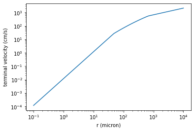
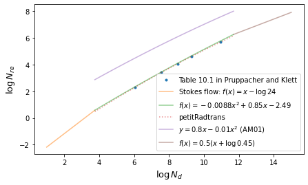

Terminal Velocity of Cloud Particles
====================================

Here, we explain how `atm.vterm.vf <../exojax/exojax.atm.html#exojax.atm.vterm.vf>`_ computes a terminal velocity as a function of the condensate (cloud) radius.

.. code:: ipython3

    import numpy as np
    import pandas as pd
    import matplotlib.pyplot as plt

.. code:: ipython3

    import exojax.atm.viscosity as vc
    import jax.numpy as jnp
    
    g=980.0 #gravity cm/s2
    drho=1.0 #condensate density g/cm3
    rho=1.29*1.e-3 #atmosphere density g/cm3
    vfactor,Tr=vc.calc_vfactor(atm="Air") #we use Air
    eta=vc.eta_Rosner(300.0,vfactor) #dynamic viscosity at 300K
    r=jnp.logspace(-5,0,70) # radius array (cm)

The terminal velocity of the cloud particle can be computed using
atm.vterm.vf

.. code:: ipython3

    from exojax.atm.vterm import vf
    vterminal=vf(r,g,eta,drho,rho)

.. code:: ipython3

    plt.plot(r*1e4,vterminal)
    plt.xscale("log")
    plt.yscale("log")
    
    plt.xlabel("r (micron)")
    plt.ylabel("terminal velocity (cm/s)")
    plt.savefig("vterm.pdf", bbox_inches="tight", pad_inches=0.0)
    plt.show()

In the above figure, you see three regimes of the r dependence on the
terminal velocity. For small r, the terminal velocity obeys the Stokes
flow. In the mid - large r (i.e. medium and large Reynolds number Nre),
exojax uses a phenomenological modeling as explained below.

We start from importing the the drag coefficients as Nre from Table 10.1
p381 in Pruppacher and Klett

.. code:: ipython3

    data = pd.read_csv("~/exojax/data/clouds/drag_force.txt",comment="#",delimiter=",")

Let’s fit logarithms of Davies number :math:`N_D = C_d N_{re}^2` and
Reynolds number :math:`N_{re}` by a polynomial equation.

.. code:: ipython3

    Nre=data["Nre"].values
    logNre=np.log(Nre) #Reynolds number
    Cd=(data["Cd_rigid"].values)
    logNd=np.log(Nre**2*Cd)
    
    Cdinf=0.45
    Nreinf=np.logspace(3,5,30)
    logNreinf=np.log(Nreinf)
    logNdinf=np.log(Nreinf**2*Cdinf)

.. code:: ipython3

    coeff=np.polyfit(logNd,logNre,2)
    coeff

.. parsed-literal::

    array([-0.00883374,  0.84514511, -2.49105354])

These are the coefficient we use in exojax in the mid Nre regime.

i.e.

:math:`\log{N_{re}} = 0.0088 \log^2{N_{D}} + 0.85 \log{N_{D}} + 2.49`

Davies number can be computed using the following function.

.. code:: ipython3

    from exojax.atm.vterm import Ndavies
    
    g=980.0 #gravity cm/s2
    drho=1.0 #condensate density g/cm3
    rho=1.29*1.e-3 #atmosphere density g/cm3
    vfactor,Tr=vc.calc_vfactor(atm="Air") #we use Air
    eta=vc.eta_Rosner(300.0,vfactor) #dynamic viscosity at 300K
    r=0.01 #cm
    print("Davies number=",Ndavies(r,g,eta,drho,rho))

.. parsed-literal::

    Davies number= 400.34301797889896

We would obtain a boundary between the mid Nre regime and the Stokes
flow.

.. code:: ipython3

    #boundary between the Stokes flow and the mid Nre regime
    #-0.00883374*xarr**2+(0.84514511-1)*xarr-2.49105354 +log(24) = 0
    a=-0.0088 #coeff[0]
    b=0.85-1 #coeff[1]-1
    c=-2.49+np.log(24.) #coeff[2]+np.log(24.)
    logNdc=(-b-np.sqrt(b*b-4*a*c))/(2*a)
    Ndc=np.exp(logNdc)   #boundary for Davies number
    Nrec=np.exp(logNdc-np.log(24.)) #boundary for Reynolds number

.. code:: ipython3

    logNdc, Ndc, Nrec

.. parsed-literal::

    (3.7583482270854875, 42.87754348901474, 1.7865643120422807)

Also, for large Nre, we assume Cd=0.45 following Akerman and Marley
2001.

.. code:: ipython3

    #boundary between the mid and large Nre regime
    #-0.00883374*xarr**2+(0.84514511-0.5)*xarr-2.49105354 +0.5*log(0.45) = 0
    a=-0.0088 #coeff[0]
    b=0.85-0.5 #coeff[1]-0.5
    c=-2.49+0.5*np.log(0.45) #coeff[2]+0.5*np.log(0.45)
    logNde=(-b+np.sqrt(b*b-4*a*c))/(2*a)
    Nde=np.exp(logNde)
    Nree=np.exp(0.5*logNde-0.5*np.log(0.45))

.. code:: ipython3

    logNde, Nde, Nree

.. parsed-literal::

    (11.692270778931425, 119643.38181447262, 515.629888398587)

The following figure shows Davies number - Reynolds number relation we
assume in exojax.

.. code:: ipython3

    plt.figure(figsize=(7,4))
    plt.plot(logNd,logNre,".",label="Table 10.1 in Pruppacher and Klett")
    
    xarr=np.linspace(1,logNdc,100)
    plt.plot(xarr,xarr - np.log(24.),alpha=0.5,label="Stokes flow: $f(x)=x-\log{24}$")
    xarr=np.linspace(logNdc,logNde,100)
    plt.plot(xarr,-0.0088*xarr**2+0.85*xarr-2.49,alpha=0.5,label="$f(x)=-0.0088 x^2+0.85 x-2.49$")
    plt.plot(xarr,-2.7905+0.9209*xarr-0.0135*xarr**2,label="petitRadtrans",ls="dotted",alpha=0.5)
    plt.plot(xarr,0.8*xarr-0.01*xarr**2,label="$y=0.8x-0.01x^2$ (AM01)",alpha=0.5)
    
    xarr=np.linspace(logNde,15,100)
    plt.plot(xarr,0.5*(xarr-np.log(0.45)) ,alpha=0.5,label="$f(x)=0.5(x+\\log{0.45})$  ")
    plt.xlabel("$\\log{N_d}$",fontsize=13)
    plt.ylabel("$\\log{N_{re}}$",fontsize=13)
    plt.legend(loc="lower right")
    plt.savefig("davies_reynolds.png")

Notice that there is a typo (?) in Akerman and Marley (2001), tagged by
“AM01”.

Using this relation, we can compute the Reynolds number, then we can
also compute the terminal velocity using

:math:`v_f(r) = \frac{2}{9 \eta} g r^2 (\rho_c - \rho) \left( \frac{C_d N_{re}}{24} \right)^{-1}`.

That’s how exojax compute the terminal velocityin `atm.vterm.vf <../exojax/exojax.atm.html#exojax.atm.vterm.vf>`_.

